# Introduction

This report contains details on the implementation of the student growth percentiles (SGP) for the state of Washington. The National Center for the Improvement of Educational
Assessment (NCIEA) contracted with the Washington Office of Superintendent of Public Instruction (OSPI) to implement the SGP methodology using data derived from the Washington Comprehensive 
Assessment Program. The goal of the engagement with OSPI is to conduct a set of initial analyses that will eventually be conducted by OSPI in following years.  

The SGP methodology is a norm- and criterion-referenced student growth analysis that produces student growth percentiles and student growth projections/targets for each student with longitudinal
data in the state. The methodology is not designed for any particular use. States and districts have used the results in various way including parent/student diagnostic reporting, institutional
and personnel accountability. The Washington OSPI use of these data for accountability purposes is not a part of this report and as of the time of this writing continues to evolve.

The report includes three sections and multiple appendices covering: Data, SGP Results, and Goodness of Fit:

* *Data* includes details on the decision rules used in the raw data preparation and student record validation.
* *SGP Results* provides basic descriptive statistics from the 2013 analyses.
* The *Goodness of Fit* section provides details about how well the statistical models used to produce SGPs fit Washington students' data.  This includes discussion of goodness of fit plots and the student- and school-level correlations between SGP and prior achievement.

# Data
Data for the Washington Comprehensive Assessment Program (WCAP) used in the SGP analyses were supplied by the Washington OSPI to the NCIEA for analysis in the fall of 2013. The current
longitudinal data set includes academic years 2005-2006 through 2012-2013. Subsequent years' analyses will augment this multi-year data set allow OSPI to maintain a comprehensive 
longitudinal data set for all students taking the WCAP. 

Student Growth Percentiles have been produced for students that have a current score and at least one prior score in the same subject or a related content area.  SGPs were produced for grade-level Reading and Mathematics, as well as high school End of Course (EOC) Mathematics 1 (Algebra) and 2 (Geometry).

## Longitudinal Data
Growth analyses on assessment data require data which are linked to individual students over time.  Student growth percentile analyses require, at a minimum two, and preferably three years of assessment data for analysis of student progress. To this end it is necessary that a unique student identifier be available so that student data records across years can be merged with one another and subsequently examined. Because some records in the assessment data set contain students with more than one test score in a content area in a given year, a process to create unique student records in each content area by year combination was required in order to carry out subsequent growth analyses. The elimination of duplicate records was accomplished by selecting one of the multiple records based upon the following decision rules:

1. If a student took more than one assessment, in the same subject, test type, grade and school year, their highest score was selected.  
2. If a student took more than one assessment in the same grade, subject and school year, their highest score was selected.  
3. If as student took more than one assessment in the same subject and school year, but was identified as being in two different grades, their highest score was selected.

OSPI identified duplicates as invalid in the 2013 panel data prior to calculation. 

Other student records may be invalid for use in SGP production for other reasons. The following data cleaning rules were applied in 2013:

1. Records from test administrations other than spring were invalidated. 
2. Records with a `TestAttempt` value other than `TS` were invalidated.
3. Records with a `GRADE` value outside of the official tested grades were invalidated.
4. Students in Home Based or Private schooling environments were invalidated, as were students with a F1 Visa designation.
5. Records with `DAPE` and `PORT` designations for `TestType` were invalidated.
6. Students with missing (`NA`) student identifiers or scale scores were invalidated.
7. Scores of students that repeated an end of course math assessment in the current year, with a math end of course assessment score in the previous year during the spring test administration were invalidated.
8. Scores of students that repeated a grade were invalidated.

Table  shows the number of valid student records available for analysis after applying these business rules.[$^1$](#footnotes)

<table class='gmisc_table' style='border-collapse: collapse;'  id='table_1'>
	<caption align='top' style='text-align: left;'>
	Table 1: Number of Valid Student Records by Grade and Subject for 2013</caption>
	<thead>
	<tr>
		<th colspan='1' style='font-weight: 900; border-top: 4px double grey;; text-align: center;'>&nbsp;</th><th style='border-top: 4px double grey;; border-bottom: hidden;'>&nbsp;</th>
		<th colspan='8' style='font-weight: 900; border-bottom: 1px solid grey; border-top: 4px double grey;'>Grades</th>
	</tr>
	<tr>
		<th style='border-bottom: 1px solid grey;; text-align: center;'>Content Area</th>
		<th style='border-bottom: 1px solid grey;' colspan='1'>&nbsp;</th>
		<th style='border-bottom: 1px solid grey;; text-align: center;'>3</th>
		<th style='border-bottom: 1px solid grey;; text-align: center;'>4</th>
		<th style='border-bottom: 1px solid grey;; text-align: center;'>5</th>
		<th style='border-bottom: 1px solid grey;; text-align: center;'>6</th>
		<th style='border-bottom: 1px solid grey;; text-align: center;'>7</th>
		<th style='border-bottom: 1px solid grey;; text-align: center;'>8</th>
		<th style='border-bottom: 1px solid grey;; text-align: center;'>9</th>
		<th style='border-bottom: 1px solid grey;; text-align: center;'>10</th>
	</tr>
	</thead><tbody>
	<tr>
		<td style=';; text-align: right;'>Reading</td>
		<td style=';' colspan='1'>&nbsp;</td>
		<td style=';; text-align: right;'>76,620</td>
		<td style=';; text-align: right;'>76,305</td>
		<td style=';; text-align: right;'>75,536</td>
		<td style=';; text-align: right;'>77,007</td>
		<td style=';; text-align: right;'>77,159</td>
		<td style=';; text-align: right;'>76,664</td>
		<td style=';; text-align: right;'></td>
		<td style=';; text-align: right;'>73,753</td>
	</tr>
	<tr>
		<td style=';; text-align: right;'>Mathematics</td>
		<td style=';' colspan='1'>&nbsp;</td>
		<td style=';; text-align: right;'>76,657</td>
		<td style=';; text-align: right;'>76,308</td>
		<td style=';; text-align: right;'>75,551</td>
		<td style=';; text-align: right;'>76,992</td>
		<td style=';; text-align: right;'>77,182</td>
		<td style=';; text-align: right;'>76,688</td>
		<td style=';; text-align: right;'></td>
		<td style=';; text-align: right;'></td>
	</tr>
	<tr>
		<td style=';; text-align: right;'>EOC Mathematics 1</td>
		<td style=';' colspan='1'>&nbsp;</td>
		<td style=';; text-align: right;'></td>
		<td style=';; text-align: right;'></td>
		<td style=';; text-align: right;'></td>
		<td style=';; text-align: right;'></td>
		<td style=';; text-align: right;'>7,841</td>
		<td style=';; text-align: right;'>25,973</td>
		<td style=';; text-align: right;'>37,805</td>
		<td style=';; text-align: right;'>9,744</td>
	</tr>
	<tr>
		<td style='border-bottom: 1px solid grey;; text-align: right;'>EOC Mathematics 2</td>
		<td style='border-bottom: 1px solid grey;' colspan='1'>&nbsp;</td>
		<td style='border-bottom: 1px solid grey;; text-align: right;'></td>
		<td style='border-bottom: 1px solid grey;; text-align: right;'></td>
		<td style='border-bottom: 1px solid grey;; text-align: right;'></td>
		<td style='border-bottom: 1px solid grey;; text-align: right;'></td>
		<td style='border-bottom: 1px solid grey;; text-align: right;'></td>
		<td style='border-bottom: 1px solid grey;; text-align: right;'>5,993</td>
		<td style='border-bottom: 1px solid grey;; text-align: right;'>22,627</td>
		<td style='border-bottom: 1px solid grey;; text-align: right;'>32,957</td>
	</tr>
	</tbody>
</table>

# SGP Results
The following sections provide basic descriptive statistics from the 2013 analyses, including the state-level median growth percentiles and the percent of students who are on-track to either attain or maintain proficiency in two years or less.

## Median SGPs
Growth percentiles, being quantities associated with each individual student, can be easily summarized across numerous grouping indicators to provide summary results regarding growth. The median of a collection of growth percentiles is used as the measure of central tendency to summarize the distribution as a single number. With perfect data fit, we expect the state median of all student growth percentiles in any grade to be 50 because the data are norm-referenced across all students in the state.   Median growth percentiles well below 50 represent growth less than the state "average" and median growth percentiles well above 50 represent growth in excess of the state "average". 

<!-- Coordinate R and Javascript Table Counters.  R will be done internally this time through creation of table and htmlTable function -->

To demonstrate the normative nature of the growth percentiles viewed at the state level, Table  presents growth percentile medians by grade level in all four content areas. 

<table class='gmisc_table' style='border-collapse: collapse;'  id='table_2'>
	<caption align='top' style='text-align: left;'>
	Table 2: Median Student Growth Percentile by Grade and Content Area</caption>
	<thead>
	<tr>
		<th colspan='1' style='font-weight: 900; border-top: 4px double grey;; text-align: center;'>&nbsp;</th><th style='border-top: 4px double grey;; border-bottom: hidden;'>&nbsp;</th>
		<th colspan='7' style='font-weight: 900; border-bottom: 1px solid grey; border-top: 4px double grey;'>Grades</th>
	</tr>
	<tr>
		<th style='border-bottom: 1px solid grey;; text-align: center;'>Content Area</th>
		<th style='border-bottom: 1px solid grey;' colspan='1'>&nbsp;</th>
		<th style='border-bottom: 1px solid grey;; text-align: center;'>4</th>
		<th style='border-bottom: 1px solid grey;; text-align: center;'>5</th>
		<th style='border-bottom: 1px solid grey;; text-align: center;'>6</th>
		<th style='border-bottom: 1px solid grey;; text-align: center;'>7</th>
		<th style='border-bottom: 1px solid grey;; text-align: center;'>8</th>
		<th style='border-bottom: 1px solid grey;; text-align: center;'>9</th>
		<th style='border-bottom: 1px solid grey;; text-align: center;'>10</th>
	</tr>
	</thead><tbody>
	<tr>
		<td style=';; text-align: right;'>Reading</td>
		<td style=';' colspan='1'>&nbsp;</td>
		<td style=';; text-align: right;'>49</td>
		<td style=';; text-align: right;'>50</td>
		<td style=';; text-align: right;'>50</td>
		<td style=';; text-align: right;'>50</td>
		<td style=';; text-align: right;'>50</td>
		<td style=';; text-align: right;'></td>
		<td style=';; text-align: right;'>50</td>
	</tr>
	<tr>
		<td style=';; text-align: right;'>Mathematics</td>
		<td style=';' colspan='1'>&nbsp;</td>
		<td style=';; text-align: right;'>49</td>
		<td style=';; text-align: right;'>50</td>
		<td style=';; text-align: right;'>50</td>
		<td style=';; text-align: right;'>50</td>
		<td style=';; text-align: right;'>50</td>
		<td style=';; text-align: right;'></td>
		<td style=';; text-align: right;'></td>
	</tr>
	<tr>
		<td style=';; text-align: right;'>EOC Mathematics 1</td>
		<td style=';' colspan='1'>&nbsp;</td>
		<td style=';; text-align: right;'></td>
		<td style=';; text-align: right;'></td>
		<td style=';; text-align: right;'></td>
		<td style=';; text-align: right;'>50</td>
		<td style=';; text-align: right;'>50</td>
		<td style=';; text-align: right;'>51</td>
		<td style=';; text-align: right;'>50</td>
	</tr>
	<tr>
		<td style='border-bottom: 1px solid grey;; text-align: right;'>EOC Mathematics 2</td>
		<td style='border-bottom: 1px solid grey;' colspan='1'>&nbsp;</td>
		<td style='border-bottom: 1px solid grey;; text-align: right;'></td>
		<td style='border-bottom: 1px solid grey;; text-align: right;'></td>
		<td style='border-bottom: 1px solid grey;; text-align: right;'></td>
		<td style='border-bottom: 1px solid grey;; text-align: right;'></td>
		<td style='border-bottom: 1px solid grey;; text-align: right;'></td>
		<td style='border-bottom: 1px solid grey;; text-align: right;'>50</td>
		<td style='border-bottom: 1px solid grey;; text-align: right;'>49</td>
	</tr>
	</tbody>
</table>

Based upon perfect model fit to the data, the median of all state growth percentiles in each grade by year by subject combination should be 50. That is, in the conditional distributions, 50 percent of growth percentiles should be less than 50 and 50 percent should be greater than 50. Deviations from 50 indicate imperfect model fit to the data. Imperfect model fit can occur for a number of reasons, some due to issues with the data (e.g., floor and ceiling effects leading to a "bunching" up of the data) as well as issues due to the way that the SGP function fits the data. The results in [Table ](#table_) are close to perfect, with almost all values equal to 50. The results are coarse in that they are aggregated across tens of thousands of students. More refined fit analyses are presented in the Goodness-of-Fit section that follows. Depending upon feedback from Washington OSPI, it may be desirable to tweak with some operational parameters and attempt to improve fit even further. The impact upon the operational results based on better fit is expected to be extremely minor.

It is important to note how, at the entire state level, the *normative* growth information returns very little information. What the results indicate is that a typical (or average) student in the state demonstrates 50th percentile growth. That is, "typical students" demonstrate "typical growth". The power of the normative results follows when subgroups are examined (e.g., schools, district, demographic groups, etc.) Examining subgroups in terms of the median of their student growth percentiles, it is then possible to investigate why some subgroups display lower/higher student growth than others. Moreover, because the subgroup summary statistic (i.e., the median) is composed of many individual student growth percentiles, one can break out the result and further examine the distribution of individual results. 

## Adequate Growth (Growth to Standard) <a id="adequate-growth">
To fully understand the rates of student growth in the state, it is necessary to complement the normative growth results with a standard based interpretation. These so called growth-to-standard results currently find favor in the growth model approved for using as AYP criteria under No Child Left Behind (NCLB). Whereas normative growth answers the question "What is?", growth-to-standard analyses attempt to establish a threshold answering "What should be?". If universal proficiency is the goal of the education system, then growth adequacy can be anchored to that achievement target.  Please refer to [section 5.5](#defining-adequate-growth) for a more detailed discussion of "Adequate Growth".
	

The top panel of Table  below shows the percent of students that are predicted to be on track to either "Catch Up" (attain proficiency if they match or exceed the level of growth demonstrated in 2013 for the next two years) or "Keep up" (maintain proficiency with consistent growth over two years).  The second panel depicts the percent of students who are on track to either "Move Up" to advanced (attain the highest proficiency level with consistent growth) or "Stay Up" (maintain the advanced proficiency level).

<table class='gmisc_table' style='border-collapse: collapse;'  id='table_3'>
	<caption align='top' style='text-align: left;'>
	Table 3: Percent of Students with Adequate Growth (On-Track to Attain or Maintain Proficiency)</caption>
	<thead>
	<tr>
		<th colspan='1' style='font-weight: 900; border-top: 4px double grey;; text-align: center;'>&nbsp;</th><th style='border-top: 4px double grey;; border-bottom: hidden;'>&nbsp;</th>
		<th colspan='6' style='font-weight: 900; border-bottom: 1px solid grey; border-top: 4px double grey;'>Grades</th>
	</tr>
	<tr>
		<th style='border-bottom: 1px solid grey;; text-align: center;'>Content Area</th>
		<th style='border-bottom: 1px solid grey;' colspan='1'>&nbsp;</th>
		<th style='border-bottom: 1px solid grey;; text-align: center;'>4</th>
		<th style='border-bottom: 1px solid grey;; text-align: center;'>5</th>
		<th style='border-bottom: 1px solid grey;; text-align: center;'>6</th>
		<th style='border-bottom: 1px solid grey;; text-align: center;'>7</th>
		<th style='border-bottom: 1px solid grey;; text-align: center;'>8</th>
		<th style='border-bottom: 1px solid grey;; text-align: center;'>10</th>
	</tr>
	</thead><tbody>
	<tr><td colspan='8' style='font-weight: 900;'>Catching or Keeping Up</td></tr>
	<tr>
		<td style=';; text-align: right;'>Reading</td>
		<td style=';' colspan='1'>&nbsp;</td>
		<td style=';; text-align: right;'>65.1</td>
		<td style=';; text-align: right;'>65.6</td>
		<td style=';; text-align: right;'>60.4</td>
		<td style=';; text-align: right;'>65.9</td>
		<td style=';; text-align: right;'>71.7</td>
		<td style=';; text-align: right;'>86</td>
	</tr>
	<tr>
		<td style=';; text-align: right;'>Mathematics</td>
		<td style=';' colspan='1'>&nbsp;</td>
		<td style=';; text-align: right;'>58.3</td>
		<td style=';; text-align: right;'>60.1</td>
		<td style=';; text-align: right;'>54.4</td>
		<td style=';; text-align: right;'>56.6</td>
		<td style=';; text-align: right;'>53.1</td>
		<td style=';; text-align: right;'></td>
	</tr>
	<tr><td colspan='9' style='font-weight: 900; border-top: 1px solid grey;'>Moving or Staying Up</td></tr>
	<tr>
		<td style=';; text-align: right;'>Reading</td>
		<td style=';' colspan='1'>&nbsp;</td>
		<td style=';; text-align: right;'>42.7</td>
		<td style=';; text-align: right;'>50.5</td>
		<td style=';; text-align: right;'>43.6</td>
		<td style=';; text-align: right;'>57.5</td>
		<td style=';; text-align: right;'>57.8</td>
		<td style=';; text-align: right;'>75.6</td>
	</tr>
	<tr>
		<td style='border-bottom: 1px solid grey;; text-align: right;'>Mathematics</td>
		<td style='border-bottom: 1px solid grey;' colspan='1'>&nbsp;</td>
		<td style='border-bottom: 1px solid grey;; text-align: right;'>42.3</td>
		<td style='border-bottom: 1px solid grey;; text-align: right;'>45.5</td>
		<td style='border-bottom: 1px solid grey;; text-align: right;'>44.3</td>
		<td style='border-bottom: 1px solid grey;; text-align: right;'>48.9</td>
		<td style='border-bottom: 1px solid grey;; text-align: right;'>40.9</td>
		<td style='border-bottom: 1px solid grey;; text-align: right;'></td>
	</tr>
	</tbody>
</table>

# Goodness of Fit
Examination of goodness-of-fit was conducted by comparing the estimated conditional density with the theoretical uniform density of the SGPs. Despite the use of B-splines to accommodate heteroscedasticity and skewness of the conditional density, assumptions are made concerning the number and position of spline knots that impact the percentile curves that are fit. With an infinite population of test takers, at each prior scaled score, with perfect model fit, the expectation is to have 10 percent of the estimated growth percentiles between 1 and 9, 10 and 19, 20 and 29, ..., and 90 and 99. Deviations from 10 percent would be indicative of lack of model fit. 

Using all available Reading, Mathematics, EOC Mathematics 1 and EOC Mathematics 2 scores as the variables, estimation of student growth percentiles was conducted for each student. Percentages of student growth percentiles between the 10th, 20th, 30th, 40th, 50th, 60th, 70th, 80th, and 90th percentiles were calculated based upon the decile of the prior year's scaled score (the total students in each for the analyses varies depending on grade and subject). Results for the B-spline parameterizations for Reading and Mathematics are given in the [Appendix B](#appendix-b---model-fit-plots). 

The results in all subjects are excellent with a few exceptions. In grade 4, for example, deviations from perfect fit are indicated by red and blue shading.  The further *above* 10 the darker the red, and the further *below* 10 the darker the blue. In instances where large deviations from 10 occur, the likely cause is that there is a point mass associated with certain scale scores that makes it impossible to "split" the score at a dividing point forcing a majority of the scores into an adjacent cell. This is the case with all large deviations observed in the Washington data. 

## Student Level Results
To investigate the possibility that individual level misfit might impact summary level results, student growth percentile analyses were run on all students and the results were examined relative to prior achievement. With perfect fit to data, the correlation between students' most recent prior achievement scores and their student growth percentiles is zero. (i.e., the goodness of fit tables would have a uniform distribution of percentiles across all previous scale score levels). To investigate in another way, correlations between prior student scale scores and student growth percentiles were calculated.[$^2$](#footnotes) The results are presented in Table :

<table class='gmisc_table' style='border-collapse: collapse;'  id='table_4'>
	<caption align='top' style='text-align: left;'>
	Table 4: Correlations between prior standardized scale score and Cohort SGPs by Grade and Content Area</caption>
	<thead>
	<tr>
		<th colspan='1' style='font-weight: 900; border-top: 4px double grey;; text-align: center;'>&nbsp;</th><th style='border-top: 4px double grey;; border-bottom: hidden;'>&nbsp;</th>
		<th colspan='7' style='font-weight: 900; border-bottom: 1px solid grey; border-top: 4px double grey;'>Grades</th>
	</tr>
	<tr>
		<th style='border-bottom: 1px solid grey;; text-align: center;'>Content Area</th>
		<th style='border-bottom: 1px solid grey;' colspan='1'>&nbsp;</th>
		<th style='border-bottom: 1px solid grey;; text-align: center;'>4</th>
		<th style='border-bottom: 1px solid grey;; text-align: center;'>5</th>
		<th style='border-bottom: 1px solid grey;; text-align: center;'>6</th>
		<th style='border-bottom: 1px solid grey;; text-align: center;'>7</th>
		<th style='border-bottom: 1px solid grey;; text-align: center;'>8</th>
		<th style='border-bottom: 1px solid grey;; text-align: center;'>9</th>
		<th style='border-bottom: 1px solid grey;; text-align: center;'>10</th>
	</tr>
	</thead><tbody>
	<tr>
		<td style=';; text-align: right;'>Reading</td>
		<td style=';' colspan='1'>&nbsp;</td>
		<td style=';; text-align: right;'>-0.012</td>
		<td style=';; text-align: right;'>-0.003</td>
		<td style=';; text-align: right;'>-0.001</td>
		<td style=';; text-align: right;'>0</td>
		<td style=';; text-align: right;'>-0.005</td>
		<td style=';; text-align: right;'></td>
		<td style=';; text-align: right;'>-0.001</td>
	</tr>
	<tr>
		<td style=';; text-align: right;'>Mathematics</td>
		<td style=';' colspan='1'>&nbsp;</td>
		<td style=';; text-align: right;'>-0.006</td>
		<td style=';; text-align: right;'>-0.002</td>
		<td style=';; text-align: right;'>-0.001</td>
		<td style=';; text-align: right;'>0</td>
		<td style=';; text-align: right;'>-0.003</td>
		<td style=';; text-align: right;'></td>
		<td style=';; text-align: right;'></td>
	</tr>
	<tr>
		<td style=';; text-align: right;'>EOC Mathematics 1</td>
		<td style=';' colspan='1'>&nbsp;</td>
		<td style=';; text-align: right;'></td>
		<td style=';; text-align: right;'></td>
		<td style=';; text-align: right;'></td>
		<td style=';; text-align: right;'>0.003</td>
		<td style=';; text-align: right;'>0.003</td>
		<td style=';; text-align: right;'>0.008</td>
		<td style=';; text-align: right;'>-0.007</td>
	</tr>
	<tr>
		<td style='border-bottom: 1px solid grey;; text-align: right;'>EOC Mathematics 2</td>
		<td style='border-bottom: 1px solid grey;' colspan='1'>&nbsp;</td>
		<td style='border-bottom: 1px solid grey;; text-align: right;'></td>
		<td style='border-bottom: 1px solid grey;; text-align: right;'></td>
		<td style='border-bottom: 1px solid grey;; text-align: right;'></td>
		<td style='border-bottom: 1px solid grey;; text-align: right;'></td>
		<td style='border-bottom: 1px solid grey;; text-align: right;'></td>
		<td style='border-bottom: 1px solid grey;; text-align: right;'>0.002</td>
		<td style='border-bottom: 1px solid grey;; text-align: right;'>0.005</td>
	</tr>
	</tbody>
</table>

Here we see that there is no correlation at the individual student-level between growth and prior achievement.  This provides assurance that the models have fit the data well, and indicate that students can demonstrate high (or low) growth regardless of prior achievement.  We now proceed to a discussion of results at the institution level. 

## Group Level Results
Unlike when reporting SGPs at the individual level, when aggregating to the group level (e.g., school) the correlation between aggregate prior student 
achievement and aggregate growth is rarely zero. The correlation between prior student achievement and growth at the school level is a compelling
descriptive statistic because it indicates whether students attending schools serving higher achieving students grow faster (on average) than those
students attending schools serving lower achieving students. Results from previous state analyses show a correlation between prior achievement of 
students associated with a current school (quantified as percent at/above proficient) and the median SGP to be between 0.1 and 0.3. That is, these 
results indicate that on average, students attending schools serving lower achieving students tend to demonstrate less exemplary growth than those 
attending schools serving higher achieving students. Equivalently, based upon ordinary least squares (OLS) regression assumptions, the prior achievement level of students attending
a school accounts for between 1 and 10 percent of the variability observed in student growth. There are no definitive numbers on what this correlation 
should be, but recent studies on value-added models show similar results [(McCaffrey, Han, and Lockwood, 2008)](#mccahan2008).

### School Level Results

To illustrate these relationships visually, the bubble charts in Figures  and 
depict growth as quantified by the median SGP of students at the school against achievement/status, quantified by percentage of student at/above proficient (advanced) at the school. 
The charts have been successful in helping to motivate the discussion of the two qualities: student achievement and student growth. Though the figures are not detailed enough to 
indicate strength of relationship between growth and achievement, they are suggestive and valuable for discussions with stakeholders who are being introduced to the growth model 
for the first time.

	
School-level Bubble Plots for Washington State:  Reading, 2012-2013.

	
    
		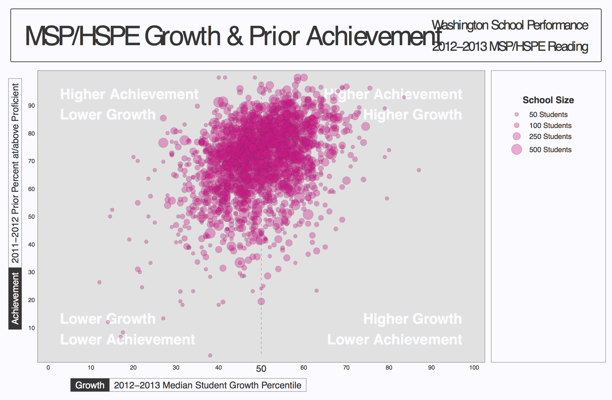
	

	
School-level Bubble Plots for Washington State:  Mathematics, 2012-2013.

	
    
		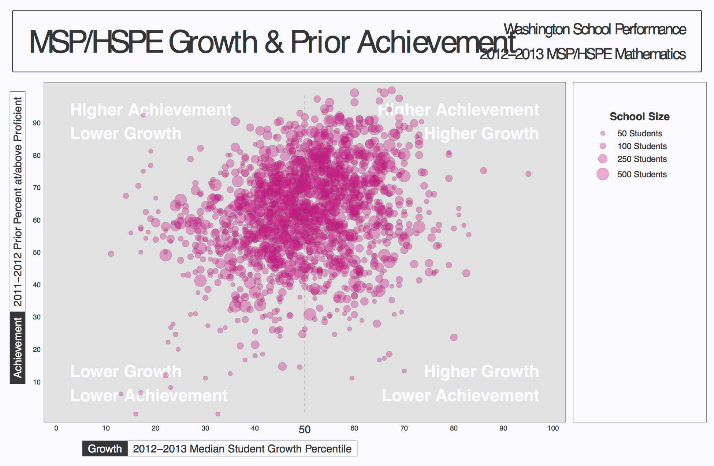
	

The relationship between average prior student achievement and median SGP observed for Washington is relatively strong compared to some other state for whom
the Center has done SGP analyses. Table  shows 
correlations between prior achievement (measured as the mean prior standardized scale score as well as the percent at/above proficient at the school[$^3$](#footnotes)).
All results shown here are for schools with 10 or more students.

<table class='gmisc_table' style='border-collapse: collapse;'  id='table_5'>
	<caption align='top' style='text-align: left;'>
	Table 5: Correlations between school-level median SGPs and mean prior standardized scale score and percent proficient by Content Area</caption>
	<thead>
	<tr>
		<th colspan='1' style='font-weight: 900; border-top: 4px double grey;; text-align: center;'>&nbsp;</th><th style='border-top: 4px double grey;; border-bottom: hidden;'>&nbsp;</th>
		<th colspan='2' style='font-weight: 900; border-bottom: 1px solid grey; border-top: 4px double grey;'>Prior Achievement Measure</th>
	</tr>
	<tr>
		<th style='border-bottom: 1px solid grey;; text-align: center;'>Content Area</th>
		<th style='border-bottom: 1px solid grey;' colspan='1'>&nbsp;</th>
		<th style='border-bottom: 1px solid grey;; text-align: center;'>Mean Prior Score</th>
		<th style='border-bottom: 1px solid grey;; text-align: center;'>Percent Prior Proficient</th>
	</tr>
	</thead><tbody>
	<tr>
		<td style=';; text-align: right;'>Reading</td>
		<td style=';' colspan='1'>&nbsp;</td>
		<td style=';; text-align: right;'>0.42</td>
		<td style=';; text-align: right;'>0.4</td>
	</tr>
	<tr>
		<td style=';; text-align: right;'>Mathematics</td>
		<td style=';' colspan='1'>&nbsp;</td>
		<td style=';; text-align: right;'>0.28</td>
		<td style=';; text-align: right;'>0.26</td>
	</tr>
	<tr>
		<td style=';; text-align: right;'>EOC Mathematics 1</td>
		<td style=';' colspan='1'>&nbsp;</td>
		<td style=';; text-align: right;'>0.26</td>
		<td style=';; text-align: right;'></td>
	</tr>
	<tr>
		<td style='border-bottom: 1px solid grey;; text-align: right;'>EOC Mathematics 2</td>
		<td style='border-bottom: 1px solid grey;' colspan='1'>&nbsp;</td>
		<td style='border-bottom: 1px solid grey;; text-align: right;'>0.32</td>
		<td style='border-bottom: 1px solid grey;; text-align: right;'></td>
	</tr>
	</tbody>
</table>

The results in Table  are similar to those found in a number of other states. It can be helpful to look at these 
correlations at the individual grade level as well.  Table  
shows correlations between SGPs and the mean prior standardized scale score by grade level.

<table class='gmisc_table' style='border-collapse: collapse;'  id='table_6'>
	<caption align='top' style='text-align: left;'>
	Table 6: Correlations between school-level median SGPs and mean prior standardized scale score by Content Area and Grade</caption>
	<thead>
	<tr>
		<th colspan='1' style='font-weight: 900; border-top: 4px double grey;; text-align: center;'>&nbsp;</th><th style='border-top: 4px double grey;; border-bottom: hidden;'>&nbsp;</th>
		<th colspan='7' style='font-weight: 900; border-bottom: 1px solid grey; border-top: 4px double grey;'>Grades</th>
	</tr>
	<tr>
		<th style='border-bottom: 1px solid grey;; text-align: center;'>Content Area</th>
		<th style='border-bottom: 1px solid grey;' colspan='1'>&nbsp;</th>
		<th style='border-bottom: 1px solid grey;; text-align: center;'>4</th>
		<th style='border-bottom: 1px solid grey;; text-align: center;'>5</th>
		<th style='border-bottom: 1px solid grey;; text-align: center;'>6</th>
		<th style='border-bottom: 1px solid grey;; text-align: center;'>7</th>
		<th style='border-bottom: 1px solid grey;; text-align: center;'>8</th>
		<th style='border-bottom: 1px solid grey;; text-align: center;'>9</th>
		<th style='border-bottom: 1px solid grey;; text-align: center;'>10</th>
	</tr>
	</thead><tbody>
	<tr>
		<td style=';; text-align: right;'>Reading</td>
		<td style=';' colspan='1'>&nbsp;</td>
		<td style=';; text-align: right;'>0.27</td>
		<td style=';; text-align: right;'>0.22</td>
		<td style=';; text-align: right;'>0.19</td>
		<td style=';; text-align: right;'>0.19</td>
		<td style=';; text-align: right;'>0.14</td>
		<td style=';; text-align: right;'></td>
		<td style=';; text-align: right;'>0.33</td>
	</tr>
	<tr>
		<td style=';; text-align: right;'>Mathematics</td>
		<td style=';' colspan='1'>&nbsp;</td>
		<td style=';; text-align: right;'>0.12</td>
		<td style=';; text-align: right;'>0.03</td>
		<td style=';; text-align: right;'>0.10</td>
		<td style=';; text-align: right;'>0.09</td>
		<td style=';; text-align: right;'>0.26</td>
		<td style=';; text-align: right;'></td>
		<td style=';; text-align: right;'></td>
	</tr>
	<tr>
		<td style=';; text-align: right;'>EOC Mathematics 1</td>
		<td style=';' colspan='1'>&nbsp;</td>
		<td style=';; text-align: right;'></td>
		<td style=';; text-align: right;'></td>
		<td style=';; text-align: right;'></td>
		<td style=';; text-align: right;'>0.29</td>
		<td style=';; text-align: right;'>0.26</td>
		<td style=';; text-align: right;'>0.25</td>
		<td style=';; text-align: right;'>0.15</td>
	</tr>
	<tr>
		<td style='border-bottom: 1px solid grey;; text-align: right;'>EOC Mathematics 2</td>
		<td style='border-bottom: 1px solid grey;' colspan='1'>&nbsp;</td>
		<td style='border-bottom: 1px solid grey;; text-align: right;'></td>
		<td style='border-bottom: 1px solid grey;; text-align: right;'></td>
		<td style='border-bottom: 1px solid grey;; text-align: right;'></td>
		<td style='border-bottom: 1px solid grey;; text-align: right;'></td>
		<td style='border-bottom: 1px solid grey;; text-align: right;'></td>
		<td style='border-bottom: 1px solid grey;; text-align: right;'>0.15</td>
		<td style='border-bottom: 1px solid grey;; text-align: right;'>0.35</td>
	</tr>
	</tbody>
</table>

Again, these results are similar to what is observed elsewhere.  Grade level correlations have been observed in the range from 0 to 0.6 in other states.

# Appendix A - An Overview of the SGP Methodology <a id="appendix-a---the-sgp-methodology">

## Introduction - Why Student Growth? <a id="why-student-growth">
Accountability systems constructed according to federal adequate yearly progress (AYP) requirements currently rely upon annual "snap-shots" of student achievement 
to make judgments about school quality. Since their adoption, such *status measures* have been the focus of persistent criticism ([Linn, 2003a](#linn2003a); 
[Linn, Baker & Betebenner, 2002](#linnbake2002)). Though appropriate for making judgments about the achievement level of students at a school for a given year, 
they are inappropriate for judgments about educational *effectiveness*. In this regard, status measures are blind to the possibility of low achieving students 
attending effective schools. It is this possibility that has led some critics of No Child Left Behind (NCLB) to label its accountability provisions as unfair and 
misguided and to demand the use of growth analyses as a better means of auditing school quality.

A fundamental premise associated with using student growth for school accountability is that "good" schools bring about student growth in excess of that found at 
"bad" schools. Students attending such schools - commonly referred to as highly effective/ineffective schools - tend to demonstrate extraordinary growth that is 
causally attributed to the school or teachers instructing the students. The inherent believability of this premise is at the heart of current enthusiasm to incorporate 
growth into accountability systems. It is not surprising that the November 2005 announcement by Secretary of Education Spellings for the Growth Model Pilot Program 
(GMPP) permitting states to use growth model results as a means for compliance with NCLB achievement mandates and the Race to the top competitive grants program 
were met with great enthusiasm by states ([Spellings, 2005](#spellings2005)).

Following these use cases, the primary thrust of growth analyses over the last decade has been to determine, using sophisticated statistical techniques, the amount of 
student progress/growth that can be justifiably attributed to the school or teacher - that is, to disentangle current *aggregate* level achievement from effectiveness 
([Braun, 2005](#braun2005); [Rubin, Stuart and Zanutto, 2004](#rubistua2004); [Ballou, Sanders and Wright, 2004](#ballsand2004); [Raudenbush, 2004](#raud2004)). 
Such analyses, often called *value-added* analyses, attempt to estimate the teacher or school contribution to student achievement. This contribution, called the *school* 
or *teacher effect*, purports to quantify the impact on achievement that this school or teacher would have, on average, upon similar students assigned to them for 
instruction. Clearly, such analyses lend themselves to accountability systems that hold schools or teachers responsible for student achievement. 

Despite their utility in high stakes accountability decisions, the causal claims of teacher/school effectiveness addressed by value-added models (VAM) often fail to 
address questions of primary interest to education stakeholders. For example, VAM analyses generally ignore a fundamental interest of stakeholders regarding student 
growth: How much growth did a student make? The disconnect reflects a mismatch between questions of interest and the statistical model employed to answer those questions. 
Along these lines, [Harris (2007)](#harris2007) distinguishes value-added for program evaluation (VAM-P) and value-added for accountability (VAM-A) - conceptualizing 
accountability as a difficult type of program evaluation.  Indeed, the current climate of high-stakes, test-based accountability has blurred the lines between program 
evaluation and accountability. This, combined with the emphasis of value-added models toward causal claims regarding school and teacher effects has skewed discussions 
about growth models toward causal claims at the expense of description. Research ([Yen, 2007](#yen2007)) and personal experience suggest stakeholders are more interested 
in the reverse: description first that can be used secondarily as part of causal fact finding.

In a survey conducted by [Yen (2007)](#yen2007), supported by the author's own experience working with state departments of education to implement growth models, parents, 
teacher, and administrators were asked what "growth" questions were most of interest to them. 

*  **Parent Questions:**
    * Did my child make a year's worth of progress in a year?
    * Is my child growing appropriately toward meeting state standards?
    * Is my child growing as much in Math as Reading?
    * Did my child grow as much this year as last year?

*  **Teacher Questions:**
    * Did my students make a year's worth of progress in a year?
    * Did my students grow appropriately toward meeting state standards?
    * How close are my students to becoming Proficient?
    * Are there students with unusually low growth who need special attention?

*  **Administrator Questions:**
    * Did the students in our district/school make a year's worth of progress in all content areas?
    * Are our students growing appropriately toward meeting state standards?
    * Does this school/program show as much growth as that one?
    * Can I measure student growth even for students who do not change proficiency categories?
    * Can I pool together results from different grades to draw summary conclusions?

As Yen remarks, all these questions rest upon a desire to understand whether observed student progress is "reasonable or appropriate" ([Yen, 2007 p. 281](#yen2007)). More broadly, the questions seek a description rather than a parsing of responsibility for student growth. Ultimately, questions may turn to who/what is responsible. However, as indicated by this list of questions, they are not the starting point for most stakeholders.

In the following paragraphs student growth percentiles and percentile growth projections/trajectories are introduced as a means of understanding student growth in both normative and a criterion referenced ways. With these values calculated we show how growth data can be utilized in both a norm- and in a criterion-referenced manner to inform discussion about education quality. We assert that the establishment of a normative basis for student growth eliminates a number of the problems of incorporating growth into accountability systems providing needed insight to various stakeholders by addressing the basic question of how much a student has progressed ([Betebenner, 2008](#betebenner2008); [Betebenner, 2009](#betebenner2009)).

## Student Growth Percentiles
It is a common misconception that to quantify student progress in education, the subject matter and grades over which growth is examined must be on the same scale - referred to as a vertical scale. Not only is a vertical scale not necessary, but its existence obscures concepts necessary to fully understand student growth. Growth, fundamentally, requires change to be examined for a single construct like math achievement across time - *growth in what?*.

Consider the familiar situation from pediatrics where the interest is on measuring the height and weight of children over time. The scales on which height and weight are measured possess properties that educational assessment scales aspire towards but can never meet.[$^4$](#footnotes)

>An infant male toddler is measured at 2 and 3 years of age and is shown to have grown 4 inches.  The magnitude of increase - 4 inches - is a well understood quantity that any parent can grasp and measure at home using a simple yardstick. However, parents leaving their pediatrician's office knowing only how much their child has grown would likely be wanting for more information. In this situation, parents are not interested in an absolute criterion of growth, but instead in a normative criterion locating that 4 inch increase alongside the height increases of similar children. Examining this height increase relative to the increases of similar children permits one to diagnose how (a)typical such an increase is.

Given this reality in the examination of change where scales of measurement are perfect, we argue that it is absurd to think that in education, where scales are at best 
quasi-interval ([Lord, 1975](#lord1975); [Yen, 1986](#yen1986)) one can/should examine growth differently.

Going further, suppose that scales did exist in education similar to height/weight scales that permitted the calculation of absolute measures of annual academic growth for students. The response to a parent's question such as, "How much did my child progress?", would be a number of scale score points - an answer that would leave most parents confused wondering
whether the number of points is good or bad. As in pediatrics, the search for a description regarding changes in achievement over time (i.e., growth) is best served by considering a norm-referenced quantification of student growth - *a student growth percentile*  ([Betebenner, 2008](#betebenner2008); [Betebenner, 2009](#betebenner2009)).

A student's growth percentile describes how (a)typical a student's growth is by examining his/her current achievement relative to his/her *academic peers* - those students beginning at the same place. That is, a student growth percentile examines the current achievement of a student relative to other students who have, in the past, "walked the same achievement path". Heuristically, if the state assessment data set were extremely large (in fact, infinite) in size, one could open the infinite data set and select out those students with the exact same prior scores and compare how the selected student's current year score compares to the current year scores of those students with the same prior year's scores - his/her academic peers. If the student's current year score exceeded the scores of most of his/her academic peers, in a normative sense they have done as well. If the student's current year score was less than the scores of his/her academic peers, in a normative sense they have not done as well. 

The four panels of Figure 1. depict what a student growth percentile represents in a situation considering students having only two consecutive achievement test scores.

*  **Upper Left Panel** Considering all pairs of 2011 and 2012 scores for all students in the state yields a bivariate (two variable) distribution. The higher the distribution, the more frequent the pair of scores. 
*  **Upper Right Panel** Taking account of prior achievement (i.e., conditioning upon prior achievement) fixes the value of the 2011 scale score (in this case at approximately 460) and is represented by the red slice taken out of the bivariate distribution.
*  **Lower Left Panel** Conditioning upon prior achievement defines a *conditional distribution* which represents the distribution of outcomes on the 2012 test assuming a 2011 score of 460. This distribution is indicated by the solid red slice of the distribution. 
*  **Lower Right Panel** The conditional distribution provides the context against which a student's 2012 achievement can be examined and provides the basis for a norm-referenced comparison. Students with achievement in the upper tail of the conditional distribution have demonstrated high rates of growth relative to their academic peers whereas those students with achievement in the lower tail of the distribution have demonstrated low rates of growth. Students with current achievement in the middle of the distribution could be described as demonstrating "average" or "typical" growth. In the figure provided the student scores approximately 500 on the 2012 test. Within the conditional distribution, the value of 500 lies at the 75th percentile. Thus the student's progress from 460 in 2011 to 500 in 2012 met or exceeded that of 75 percent of students starting from the same place.  It is important to note that qualifying a student growth percentile as "adequate", "good", or "enough" is a standard setting procedure that requires stakeholders to examine a student's growth *vis-a-vis* external criteria such as performance standards/levels.

	
Figures depicting the distribution associated with 2011 and 2012 student scale scores together with the conditional distribution and associated growth percentile.

	
    
		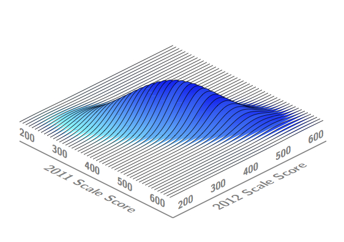
		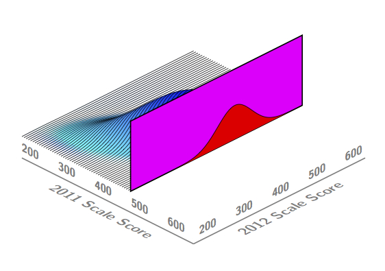
		
				
	

[Figure ](#bidensity) also serves to illustrate the relationship between the state's assessment scale and student growth percentiles. The scale used by Washington depicted in the panels of Figure 1 is not vertical. Thus the comparisons or subtraction of scale scores for individual students is not supported. However, were such a scale in place, the figure would not change. With or without a vertical scale, the conditional distribution can be constructed. In situations where a vertical scale exists, the increase/decrease in scale score points can be calculated and the growth percentile can be understood alongside this change. For example, were the scales presented in [Figure ](#bidensity) vertical, then one can calculate that the student grew 40 points (from 460 to 500) between 2011 and 2012. This 40 points represents the absolute magnitude of change. Quantifying the magnitude of change is scale dependent. For example, different vertical achievement scales in 2011 and 2012 would yield different annual scale score increases: A scale score increase of 40 could be changed to a scale score increase of 10 using a simple transformation of the vertical scale on which all the students are measured. However, relative to other students, their growth has not changed - their growth percentile is invariant to scale transformations common in educational assessment.  Student growth percentiles normatively situate achievement change bypassing questions associated with the magnitude of change, and directing attention toward relative standing which, we would assert, is what stakeholders are most interested in. 

To fully understand how many states intend to use growth percentiles to make determinations about whether a student's growth is sufficient, the next section details specifics of how student growth percentiles are calculated. These calculations are subsequently used to calculate percentile growth projections/trajectories that are used to establish how much growth it will take for each student to reach his/her achievement targets. 

## Student Growth Percentile Calculation
Quantile regression is used to establish curvi-linear functional relationships between the cohort's prior scores and the cohort's current scores. 
Specifically, for each grade by subject cohort, quantile regression is used to establish 100 (1 for each percentile) curvi-linear functional 
relationships between the students prior score(s) and their current score.  For example, consider 7th graders in 2013.  Their grade 3, grade 4, grade 5, 
and grade 6 prior scores are used to describe the current year grade 7 score distribution.[$^5$](#footnotes)
The result of these 100 separate analyses is a single coefficient matrix that can be employed as a look-up table relating prior student achievement to 
current achievement for each percentile. Using the coefficient matrix, one can plug in *any* grade 3, 4, 5, and 6 prior score combination to the functional 
relationship to get the percentile cutpoints for grade 7 conditional achievement distribution associated with that prior score combination. These cutpoints 
are the percentiles of the conditional distribution associated with the individual's prior achievement. Consider a student with the following reading scores:

<table class='gmisc_table' style='border-collapse: collapse;'  id='table_7'>
	<caption align='top' style='text-align: left;'>
	Table 7: Scale scores for a hypothetical student across 5 years in reading.</caption>
	<thead>
	<tr>
		<th style='border-bottom: 1px solid grey; border-top: 4px double grey;; text-align: center;'>Grade 3/2009</th>
		<th style='border-bottom: 1px solid grey; border-top: 4px double grey;; text-align: center;'>Grade 4/2010</th>
		<th style='border-bottom: 1px solid grey; border-top: 4px double grey;; text-align: center;'>Grade 5/2011</th>
		<th style='border-bottom: 1px solid grey; border-top: 4px double grey;; text-align: center;'>Grade 6/2012</th>
		<th style='border-bottom: 1px solid grey; border-top: 4px double grey;; text-align: center;'>Grade 7/2013</th>
	</tr>
	</thead><tbody>
	<tr>
		<td style='border-bottom: 1px solid grey;; text-align: right;'>319</td>
		<td style='border-bottom: 1px solid grey;; text-align: right;'>318</td>
		<td style='border-bottom: 1px solid grey;; text-align: right;'>322</td>
		<td style='border-bottom: 1px solid grey;; text-align: right;'>334</td>
		<td style='border-bottom: 1px solid grey;; text-align: right;'>336</td>
	</tr>
	</tbody>
</table>

<!--  ALTERNATIVE Table formats
$$\begin{array}\caption{\label{tab:scalescores} \mbox{Table~\ref{tab:scalescores} Scale scores for a hypothetical student across 5 years in reading}}\end{array}$$

$\begin{array}\caption{\label{tab:scalescores} \mbox{}}\end{array}$

**Table .**  Scale scores for a hypothetical student across 5 years in reading

|-------------+-------------+-------------+-------------+-------------|
|Grade 3/2004 | Grade 4/2005| Grade 5/2006| Grade 6/2007| Grade 7/2008|
|:-----------:+:-----------:+:-----------:+:-----------:+:-----------:|
|     319     |      318    |     322     |     334     |     336     |
|-------------+-------------+-------------+-------------+-------------|
-->

Using the coefficient matrix derived from the quantile regression analyses based upon grade 3, 4, 5, and 6 scale scores as independent variables and the 
grade 7 scale score as the dependent variable together with this student's vector of grade 3, 4, 5, and 6 grade scale scores provides the scale score 
percentile cutpoints associated with the grade 7 conditional distribution for these prior scores. 

<table class='gmisc_table' style='border-collapse: collapse;'  id='table_8'>
	<caption align='top' style='text-align: left;'>
	Table 8: Percentile cutscores for grade 7 reading based upon the grade 3, 4, 5, and 6 reading scale scores given in Table .</caption>
	<thead>
	<tr>
		<th style='border-bottom: 1px solid grey; border-top: 4px double grey;; text-align: center;'>1st</th>
		<th style='border-bottom: 1px solid grey; border-top: 4px double grey;; text-align: center;'>2nd</th>
		<th style='border-bottom: 1px solid grey; border-top: 4px double grey;; text-align: center;'>3rd</th>
		<th style='border-bottom: 1px solid grey; border-top: 4px double grey;; text-align: center;'>...</th>
		<th style='border-bottom: 1px solid grey; border-top: 4px double grey;; text-align: center;'>10th</th>
		<th style='border-bottom: 1px solid grey; border-top: 4px double grey;; text-align: center;'>...</th>
		<th style='border-bottom: 1px solid grey; border-top: 4px double grey;; text-align: center;'>25th</th>
		<th style='border-bottom: 1px solid grey; border-top: 4px double grey;; text-align: center;'>...</th>
		<th style='border-bottom: 1px solid grey; border-top: 4px double grey;; text-align: center;'>50th</th>
		<th style='border-bottom: 1px solid grey; border-top: 4px double grey;; text-align: center;'>51st</th>
		<th style='border-bottom: 1px solid grey; border-top: 4px double grey;; text-align: center;'>...</th>
		<th style='border-bottom: 1px solid grey; border-top: 4px double grey;; text-align: center;'>75th</th>
		<th style='border-bottom: 1px solid grey; border-top: 4px double grey;; text-align: center;'>...</th>
		<th style='border-bottom: 1px solid grey; border-top: 4px double grey;; text-align: center;'>90th</th>
		<th style='border-bottom: 1px solid grey; border-top: 4px double grey;; text-align: center;'>...</th>
		<th style='border-bottom: 1px solid grey; border-top: 4px double grey;; text-align: center;'>99th</th>
	</tr>
	</thead><tbody>
	<tr>
		<td style='border-bottom: 1px solid grey;; text-align: right;'>304.8</td>
		<td style='border-bottom: 1px solid grey;; text-align: right;'>314.9</td>
		<td style='border-bottom: 1px solid grey;; text-align: right;'>319.9</td>
		<td style='border-bottom: 1px solid grey;; text-align: right;'>...</td>
		<td style='border-bottom: 1px solid grey;; text-align: right;'>325.9</td>
		<td style='border-bottom: 1px solid grey;; text-align: right;'>...</td>
		<td style='border-bottom: 1px solid grey;; text-align: right;'>330.8</td>
		<td style='border-bottom: 1px solid grey;; text-align: right;'>...</td>
		<td style='border-bottom: 1px solid grey;; text-align: right;'>335.5</td>
		<td style='border-bottom: 1px solid grey;; text-align: right;'>336.3</td>
		<td style='border-bottom: 1px solid grey;; text-align: right;'>...</td>
		<td style='border-bottom: 1px solid grey;; text-align: right;'>368.9</td>
		<td style='border-bottom: 1px solid grey;; text-align: right;'>...</td>
		<td style='border-bottom: 1px solid grey;; text-align: right;'>387.1</td>
		<td style='border-bottom: 1px solid grey;; text-align: right;'>...</td>
		<td style='border-bottom: 1px solid grey;; text-align: right;'>409.8</td>
	</tr>
	</tbody>
</table>

The percentile cutscores for 7th grade reading in Table  are used with the student's *actual* 
grade 7 reading scale score to establish his/her growth percentile. In this case, the student's grade 7 scale score of 336 lies above the 50th 
percentile cut and below the 51st percentile cut, yielding a growth percentile of 50. Thus, the progress demonstrated by this student between 
grade 6 and grade 7 exceeded that of 50 percent of his/her academic peers - those students with the same achievement history. States can qualify 
student growth by defining ranges of growth percentiles. For example, the Washington Growth Model designates growth percentiles between 34 and 66 
as being *typical*. Using [Table ](#percentilecutsTable), another student with the exact same 
grade 3, 4, 5, and 6 prior scores but with a grade 7 scale score of 304, would have a growth percentile of 1, which is designated as *low*. 

This example provides the basis for beginning to understand how growth percentiles in the SGP Methodology are used to determine whether a student's growth 
is *(in)adequate*. Suppose that in grade 6 a one-year (i.e., 7th grade) achievement goal/target of proficiency was established for the student. Using 
the lowest proficient scale score for 7th grade reading, this target corresponds to a scale score of 400. Based upon the results of the growth 
percentile analysis, this one year target corresponds to 95th percentile growth. Their growth, obviously, is less than this and the student has not met 
this individualized growth standard. 

## Percentile Growth Projections/Trajectories <a id="percentile-growth-projections">
Building upon the example just presented involving only a one-year achievement target translated into a growth standard, this section extends this 
basic idea and shows how multi-year growth standards are established based upon official state achievement targets/goals. That is, by defining a 
future (e.g., a 2 year) achievement target for each student, we show how growth percentile analyses can be used to quantify what level of growth, 
expressed as a per/year growth percentile, is required by the student to reach his/her achievement target. Unique to the SGP Methodology is the 
ability to stipulate *both* what the growth standard is as well as how much the student actually grew in a metric that is informative to stakeholders. 

## Defining Adequate Growth

Establishing thresholds for growth for each student that can be used to make adequacy judgments requires pre-established achievement targets and a time-frame 
to reach the target for each student against which growth can be assessed (i.e., growth-to-standard). Washington state has determined that a timeframe of three years 
from the establishment of the target is useful for purposes of describing students growth to standard.  Targets are initially established in the prior academic year, 
so that in the current year a student is considered to be *catching-up* to or *keeping-up* with proficiency.  Other targets may also be considered (for example,
*moving-up* to or *staying-up* with an advanced achievement level).

Specifically in the Washington context, these adequacy categories are defined as:

*  ***Catch-Up*** Those students currently not proficient (from the prior spring testing) are expected to be proficient within 3 years following the establishment of the achievement target or by grade 10, whichever comes sooner.[$^6$](#footnotes)
*  ***Keep-Up*** Those students currently at or above proficient are expected to remain at or above proficient in all of the 3 years following the establishment of the achievement target or by the final grade (8th in Mathematics, 10th in Reading), whichever comes sooner.
*  ***Move-Up*** Those students currently proficient are expected to reach advanced within 3 years following the establishment of the achievement target or by the final grade, whichever comes sooner.
*  ***Stay-Up*** Those students currently advanced and are expected to remain advanced in all of the 3 years following the establishment of the achievement target or by the final grade, whichever comes sooner.

The previous definitions specify "3 years following the establishment of the achievement target" as the time frame. For example, an non-proficient 3rd grader 
would be expected to be proficient by 6th grade. The first check of the student's progress occurs in 4th grade, 
when the student's growth over the last year is compared against targets calculated to assess their progress along a multi-year time-line. The question asked following 
the 4th grade for the student is: Did the student become proficient and if not are they on track to become proficient within 3 years?

***It is important to note that Washington State is not incorporating adequate growth in any accountability measures at this time; these targets are provided as an additional descriptive measure to assist in school improvement.***

## Calculation of Growth Percentile Targets <a id="calculation-of-growth-targets">

As mentioned previously, the calculation of student growth percentiles across all grades and students results in the creation of numerous coefficient matrices that relate 
prior with current student achievement. These matrices constitute an annually updated statewide historical record of student progress. For the SGP Methodology, they are 
used to determine what level of percentile growth is necessary for each student to reach future achievement targets. For example, in the calculation of student growth 
percentiles in 2013 in Washington, the following coefficient matrices are produced for Reading:[$^7$](#footnotes)

*  **Grade 4** Using grade 3 prior achievement.
*  **Grade 5** Using grade 4 and grades 3 & 4 prior achievement.
*  **Grade 6** Using grade 5, grades 4 & 5, and grades 3, 4, & 5 prior achievement.
*  **Grade 7** Using grade 6, grades 5 & 6, grades 4, 5, & 6, and grades 3, 4, 5, & 6 prior achievement.
*  **Grade 8** Using grade 7, grades 6 & 7, grades 5, 6, & 7, grades 4, 5, 6, & 7, and grades 3, 4, 5, 6, & 7 prior achievement.
*  **Grade 10** Using grade 8, grades 7 & 8, grades 6, 7, & 8, grades 5, 6, 7, & 8, grades 4, 5, 6, 7, & 8 and grades 3, 4, 5, 6, 7, & 8 prior achievement.  These include a skipped year for 9th grade. 

To describe how these numerous coefficient matrices are used together to produce growth targets, consider, for example, a 2013 4th grade 
student in reading with 3rd and 4th grade state reading scores of 325 (Below Basic) and 340 (Below Basic), respectively. 
The following are the steps that transpire over 3 years to determine whether this student is on track to reach proficient.

*  **Spring 2012/Fall 2013 -** The growth target for 2013 is established requiring students to reach state defined achievement levels within 3 years or by grade 8. In this example, the student under consideration was Below Basic in 3rd grade (in 2012) and is expected to be proficient by grade 6 in 2015.
*  **Spring 2013 -** Because our example student was not proficient based on their prior year test score her initial status for the current year is a *catching-up* student.  We want to see if the growth she demonstrated in 2013 was adequate enough to make her proficient, or at least put her on a trajectory towards proficiency within the next two years.  Employing the coefficient matrices derived in the calculation of 2013 student growth percentiles:
    * First, the coefficient matrix relating grade 4 with grade 3 prior achievement is used to establish the percentile cuts (i.e., one-year growth percentile projections/trajectories). If the student's actual 2013 growth percentile exceeds the percentile cut associated with proficient, then the student's one year growth is enough to reach proficient.[$^8$](#footnotes) 
    * Next, the 2 year growth percentile projections/trajectories are calculated, extending from 2012 to 2014. The student's actual grade 3 scale score together with the 99 hypothetical one-year growth percentile projections/trajectories derived in the previous step are plugged into the 2013 coefficient matrix relating grade 5 with grade 3 & 4 prior achievement. This yields the percentile cuts for the student indicating what consecutive two-year 1st through 99th percentile growth will lead to.[$^9$](#footnotes) The student's 2013 growth percentile is compared to the 2 year growth percentile cut required to reach proficiency. If the student's growth percentile exceeds this target, then the student is deemed on track to reach proficiency by the 5th grade.
    * Last, the 3 year growth percentile projections/trajectories are established. The student's actual grade 3 scale score together with the 99 hypothetical 1 and 2 year growth percentile projections/trajectories derived in the previous two steps are plugged into the coefficient matrix relating grade 6 with prior achievement in grades 3, 4, & 5. This yields the percentile cuts for each student indicating what three consecutive years of 1st through 99th percentile growth will lead to in terms of future achievement.  The student's observed 2013 growth percentile is again compared to the percentile cut required to reach proficiency, and if it meets or exceeds it her growth is deemed adequate enough to reach proficiency by the 6th grade. 
*  **Spring 2013/Fall 2014 -** The growth target for 2014 is now established. The student in this example has now presumably completed grade 4 and beginning grade 5 in the Fall.  She was again Below Basic in 4th grade and is now expected to be on track to proficient by grade 7 in 2016.
*  **Spring 2014 -** Employing the coefficient matrices derived in the calculation of 2014 student growth percentiles:
    * First the coefficient matrix relating grade 5 with grade 3 & 4 prior achievement is used to establish 99 percentile cuts (i.e., one-year growth percentile projections/trajectories). If the student's actual 2014 growth percentile exceeds the cut associated with proficient, then the student's one year growth was enough to reach proficient. 
    * Next, the student's actual scores from grades 3 & 4 together with the 99 hypothetical one-year growth percentile projections/trajectories derived in the previous step are plugged into the coefficient matrix relating grade 6 with grade 3, 4, & 5 prior achievement. This yields 99 percentile cuts (i.e., 2 year growth percentile projections/trajectories) for the student indicating what consecutive two-year 1st through 99th percentile growth will lead to in terms of future achievement. The student's 2014 growth percentile is compared to the 2 year growth percentile cut required to reach proficiency. If the student's growth percentile meets or exceeds it then the student is deemed on track to reach proficient.
    * Last, the 3 year growth percentile projections/trajectories are established. The student's actual grades 3 & 4 scale scores together with the 99 hypothetical 1 and 2 year growth percentile projections/trajectories derived in the previous two steps are plugged into the coefficient matrix relating grade 7 with prior achievement in grades 3, 4, 5 & 6. This yields the percentile cuts for each student indicating what three consecutive years of 1st through 99th percentile growth will lead to in terms of future achievement.  The student's observed 2014 growth percentile is again compared to the percentile cut required to reach proficiency, and if it exceeds it her growth is deemed adequate enough to reach proficiency by the 7th grade. 

This process repeats in a similar fashion as the student progresses from one grade to the next, year after year.  The complexity of the process just described is minimized by the use of the 
`R` software environment [(R Core Team, 2013)](#rsoftware2013) in conjunction with an open source software package `SGP` [(Betebenner, VanIwaarden, Domingue & Shang, 2013)](#sgp2013) developed 
by the National Center for the Improvement of Educational Assessment in consultation with the Washington State Office of Superintendent of Public Instruction (OSPI) to calculate student growth 
percentiles and percentile growth projections/trajectories. Every year, following the completion of the WCAP score reconciliation, student growth percentiles and percentile growth 
trajectories are calculated for each student. Once calculated, these values are easily used to make the yes/no determinations about the adequacy of each student's growth relative to 
his/her fixed achievement targets.

### Special Considerations for Washington
As noted above, there is no reading test administered in the 9th grade, and the 10th grade analyses incorporate this skipped year in the production of student growth percentiles and associated coefficient matrices.  This gap, in combination with the 2-year growth target, means that 7th grade growth targets have a single year horizon (2 years out would be their 9th grade year).  Similarly, 8th grade targets rely on a single year projection as are projected over the 9th grade gap using the coefficient matrix relating grade 10 with grades 3 through 8 prior achievement.  This, like other terminal grade projections, is equivalent to just checking whether the student reached proficient in the current year.

Currently growth projections and adequate growth analyses have not be conducted for the EOC Mathematics courses.  However, the ability to produce them using the `SGP` package is currently under development and Washington may pursue their production and use in the future.

### Changes in Assessment Programs
Many states will soon switch from their current assessment programs to one of the assessments aligned to the Common Core State Standards (CCSS), such as Smarter Balanced Assessment Consortium's (SBAC) tests. This change will have a significant impact on the ability to produce growth projections and make judgments about growth adequacy.  Although cohort referenced SGPs would still be produced (conditioning on the WCAP assessment program test scores), growth projections/targets would not be available in the first year after a switch.  In the second year, one year growth projections could be produced, two year projections the year after that and so on.

## System-wide Growth and Achievement Charts <a id="growth-and-achievement-charts">
Operational work calculating student growth percentiles with state assessment data yields a large number of coefficient matrices derived 
from estimating Equation \ref{eqn:quantile}. These matrices, similar to a lookup table, "encode" the relationship between prior and current 
achievement scores for students in the norm group (usually an entire grade cohort of students for the state) across all percentiles and can 
be used both to qualify a student's current level growth as well as predict, based upon current levels of student progress, what different 
rates of growth (quantified in the percentile metric) will yield for students statewide. 

When rates of growth necessary to reach performance standards are investigated, such calculations are often referred to as "growth-to-standard". 
These analyses serve a dual purpose in that they provide the growth rates necessary to reach these standards and also shed light on the 
standard setting procedure as it plays out across grades. To establish growth percentiles necessary to reach different performance/achievement 
levels, it is necessary to investigate what growth percentile is necessary to reach the desired performance level thresholds based upon the 
student's achievement history. 

Establishing criterion referenced growth thresholds requires consideration of multiple future growth/achievement scenarios. 
Instead of inferring that prior student growth is indicative of future student growth (e.g., linearly projecting student achievement 
into the future based upon past rates of change), predictions of future student achievement are contingent upon initial student status 
(where the student starts) and subsequent rates of growth (the rate at which the student grows). This avoids fatalistic statements 
such as, "Student $X$ is projected to be (not) proficient in two years" and instead promotes discussions about the different rates 
of growth necessary to reach future achievement targets: "In order that Student $X$ reach/maintain proficiency within two years, 
she will have to demonstrate  $n^{th}$ percentile growth consecutively for the next two years." The change in phraseology is minor 
but significant. Stakeholder conversations turn from "where will (s)he be" to "what will it take?"

<!--  

-->

	
Growth chart depicting future mathematics achievement conditional upon consecutive 10th, 35th, 50th, 65th and 90th percentile growth for a student beginning the third grade at the cutpoint between lowest and next to lowest achievement levels.

	
    
		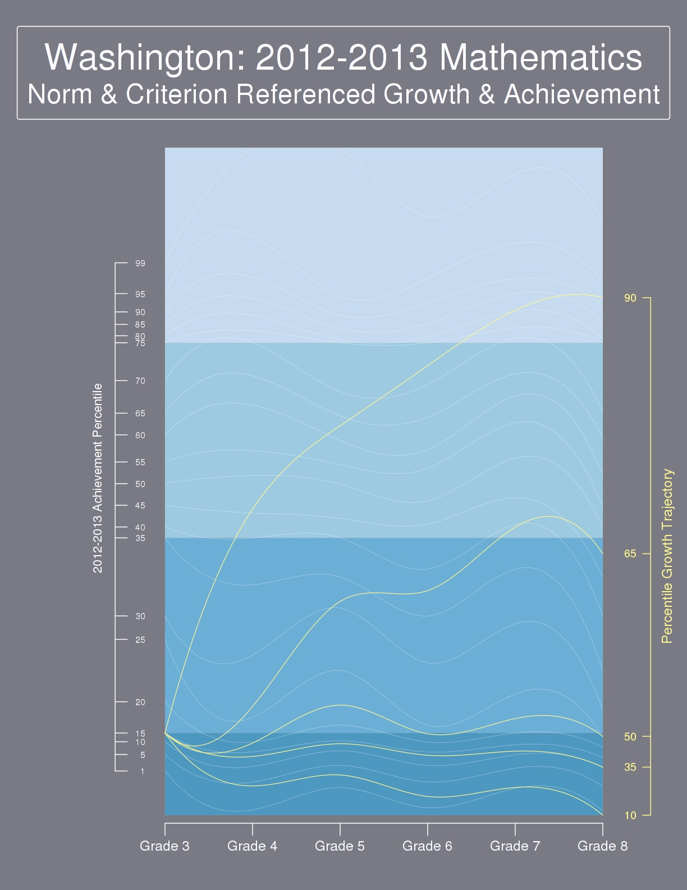
	

	
Growth chart depicting future reading achievement conditional upon consecutive 10th, 35th, 50th, 65th and 90th percentile growth for a student beginning the third grade at the cutpoint between the achievement level 2 and achievement level 3.

	
    
		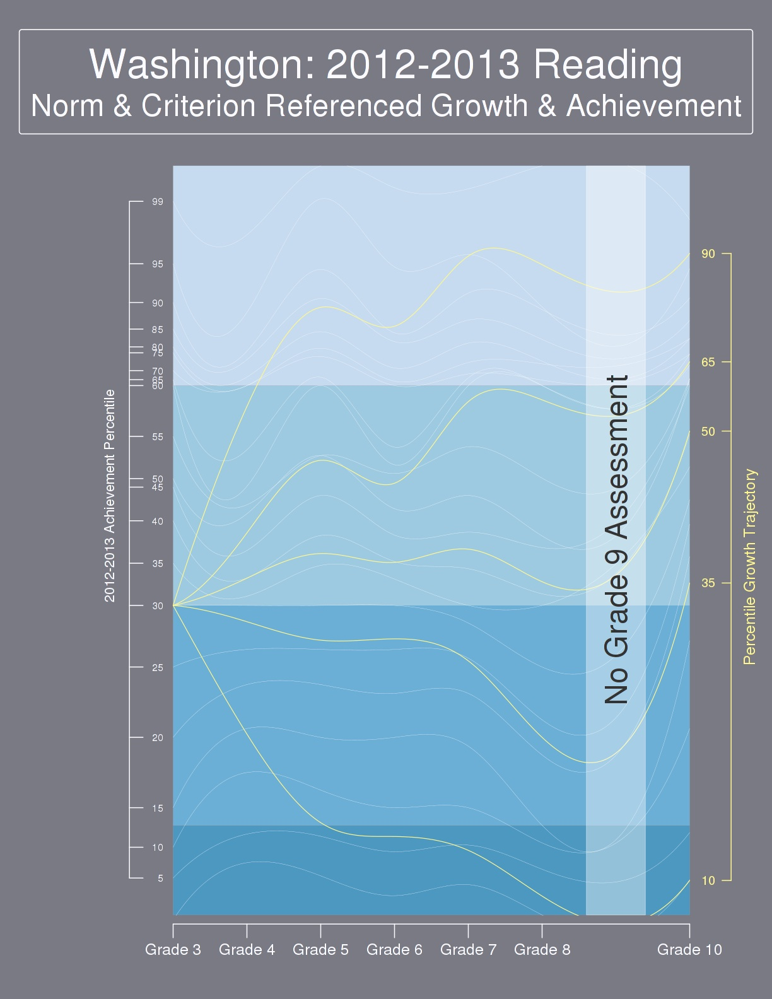
	

Parallel growth/achievement scenarios are more easily understood with a picture. Using the results of a statewide assessment growth percentile analyses, 
Figures  and  
depict future growth scenarios in math and reading, respectively, for a student starting in third grade and tracking that student's achievement time-line based 
upon different rates of annual growth expressed in the growth percentile metric. The figures depict the four state achievement levels across grades 3 to 10 
in shades of dark to light blue (Below Basic, Basic, Proficient and Advanced) together with the 2013 achievement percentiles (inner most vertical axis) superimposed 
in white. Beginning with the student's achievement starting point at grade 3 a grade 4 achievement projection is made based upon the most recent growth percentile 
analyses derived using prior 3rd to 4th grade student progress. More specifically, using the coefficient matrices derived in the quantile 
regression of grade 4 on grade 3 (see Equation \ref{eqn:quantile}), predictions of what 10th, 35th, 50th, 65th, and 
90th percentile growth lead to are calculated. Next, using these seven projected 4th grade scores combined with the student actual 3rd 
grade score, 5th grade achievement projections are calculated using the most recent quantile regression of grade 5 on grades 3 and 4. Similarly, using these 
seven projected 5th grade scores, the 5 projected 4th grade scores with the students actual third grade score, achievement projections to the 
6th grade are calculated using the most recent quantile regression of grade 6 on grades 3, 4, and 5. The analysis extends recursively for grades 6 to 10 
yielding the *percentile growth trajectories* in Figures  and 
. The figures allow stakeholders to consider what consecutive rates of growth, 
expressed in growth percentiles, yield for students starting at different points.

[Figure ](#grprojmath_belowbasic_basic) depicts percentile growth trajectories in mathematics for a 
student beginning at the threshold between achievement level 1 and achievement level 2. Based upon the *achievement* percentiles depicted (the white contour lines), 
approximately 15 percent of the population of 3rd graders rate as "Below Basic". Moving toward grade 8, the percentage of Below Basic students increases 
to near 25 percent. The yellow lines in the figure represent seven different growth scenarios for the student based upon consecutive growth at a given growth percentile, 
denoted by the right axis. At the lower end, for example, consecutive 10th percentile growth leaves the student, unsurprisingly, mired in the Below Basic 
category. Consecutive 10th, 35th,  and 50th percentile growth also leave the student in the Below Basic category.  Even consecutive 
65th percentile growth may not be enough to lift these students above Basic into the Proficient category This demonstrates how difficult probabilistically, 
based upon current rates of progress, it is for students to move up in performance level in math statewide. Considering a goal of reaching proficient (next to top region) by 8th grade, a student would need to demonstrate growth percentiles consecutively in excess of 65 to reach this achievement target indicating how unlikely such an 
event currently is. In light of NCLB universal proficiency mandates, the growth necessary for non-proficient students to reach proficiency, absent radical changes to growth rates of students statewide, is likely unattainable for a large percentage of non-proficient students. 

[Figure ](#grprojread_basic_prof) depicts percentile growth trajectories in reading for a student beginning at the 
partially proficient/proficient threshold in grade 3. In a normative sense, the performance standards in reading are less demanding than those in mathematics 
(particularly in the higher grades) with approximately 30-35 percent of students are below proficient in grades 3 to 8, decreasing to 20 percent in 10th grade. The yellow lines 
in the figure represent five growth scenarios for the hypothetical student based upon consecutive growth at a the given growth percentile. Compared with the growth required in 
mathematics, more modest growth is required to maintain proficiency in reading. Typical growth (50th percentile growth) appears adequate for such a student to move up 
into the proficiency category. 

Calculation of a student's growth percentile is based upon the estimation of the conditional density associated with a student's score at time $t$ 
using the student's prior scores at times $1, 2, \ldots, t-1$ as the conditioning variables. Given the conditional density for the student's score at 
time $t$, the student's growth percentile is defined as the percentile of the score within the time $t$ conditional density. By examining a student's
current achievement with regard to the conditional density, the student's growth percentile normatively situates the student's outcome at time $t$ 
taking account of past student performance. The percentile result reflects the likelihood of such an outcome given the student's prior achievement. 
In the sense that the student growth percentile translates to the probability of such an outcome occurring (i.e., rarity), it is possible to compare 
the progress of individuals not beginning at the same starting point. However, occurrences being equally rare does not necessarily imply that they 
are equally "good." Qualifying student growth percentiles as "(in)adequate," "good," or as satisfying "a year's growth" is a standard setting procedure 
requiring external criteria (e.g., growth relative to state performance standards) combined with the wisdom and judgments of stakeholders.

Estimation of the conditional density is performed using quantile regression [(Koenker, 2005)](#koenker2005) Whereas linear regression methods model the 
conditional mean of a response variable $Y$ , quantile regression is more generally concerned with the estimation of the family of conditional quantiles of $Y$. 
Quantile regression provides a more complete picture of both the conditional distribution associated with the response variable(s). The techniques are
ideally suited for estimation of the family of conditional quantile functions (i.e., reference percentile curves). Using quantile regression, the conditional 
density associated with each student's prior scores is derived and used to situate the student's most recent score. Position of the student's most recent score 
within this density can then be used to characterize the student's growth. Though many state assessments possess a vertical scale, such a scale is not necessary 
to produce student growth percentiles.

In analogous fashion to the least squares regression line representing the solution to a minimization problem involving squared deviations, quantile regression 
functions represent the solution to the optimization of a loss function [(Koenker, 2005)](#koenker2005). Formally, given a class of suitably smooth functions, $\cal{G}$, 
one wishes to solve

$$
\label{eqn:quantmin}
\textit{arg min}_ {g \in \cal{G}} \sum_ {i=1}^n \rho_ {\tau} (Y(t_ i) - g(t_ i)),
$$

where $t_i$ indexes time, $Y$ are the time dependent measurements, and $\rho_{\tau}$ denotes the piecewise linear loss function defined by

$$
\rho_ {\tau} (u) = u \cdot (\tau - I(u < 0)) = \begin{cases}
u \cdot \tau & u \geq 0 \\
u \cdot (\tau - 1) & u < 0.
\end{cases}
$$

The elegance of the quantile regression Expression \ref{eqn:quantmin} can be seen by considering the more familiar
least squares estimators. For example, calculation of $\textit{arg min} \sum_ {i=1}^n (Y_i - \mu)^2$ over $\mu
\in \mathbb{R}$ yields the sample mean. Similarly, if $\mu(x) = x^{\prime} \beta$ is the conditional mean
represented as a linear combination of the components of $x$, calculation of $\textit{arg min} \sum_{i=1}^n (Y_i -
x_i^{\prime} \beta)^2$ over $\beta \in \mathbb{R}^p$ gives the
familiar least squares regression line. Analogously, when the class of candidate functions $\cal{G}$ consists
solely of constant functions, the estimation of Expression \ref{eqn:quantmin} gives the $\tau$th sample quantile
associated with $Y$. By conditioning on a covariate $x$, the $\tau$th conditional quantile function, $Q_y ( \tau |
x)$, is given by

$$
Q_y (\tau | x) = \textit{arg min}_{\beta \in \mathbb{R}^{^p}} \sum_{i=1}^n \rho_{\tau} (y_i - x_i^{\prime} \beta).
$$

In particular, if $\tau=0.5$, then the estimated conditional quantile line is the median regression
line.[$^10$](#footnotes)

Following [Wei & He (2006)](#weihe2006), we parametrize the conditional quantile functions as a linear combination of B-spline cubic basis functions. 
B-splines are employed to accommodate non-linearity, heteroscedasticity and skewness of the conditional densities associated with values of the 
independent variable(s). B-splines are attractive both theoretically and computationally in that they provide excellent data fit, seldom lead to estimation
problems [(Harell, 2001, p. 20)](#harrell2001), and are simple to implement in available software.

[Figure ](#decilesplines) gives a bivariate representation of linear and B-splines parametrization of 
decile growth curves. The assumption of linearity imposes conditions upon the heteroscedasticity of the conditional densities. Close examination of the 
linear deciles indicates slightly greater variability for higher grade 5 scale scores than for lower scores. By contrast, the B-spline based decile functions 
better capture the greater variability at both ends of the scale score range together with a slight, non-linear trend to the data.

	
Linear and B-spline conditional deciles based upon bivariate math data, grades 5 and 6.

	
    
		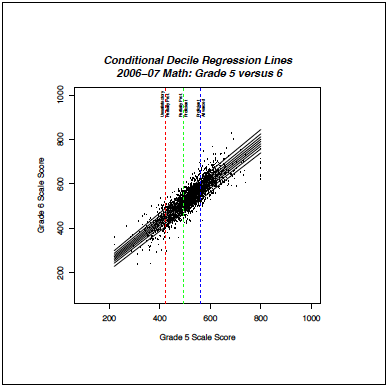
		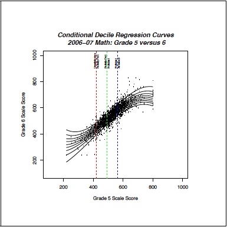
	

Calculation of student growth percentiles is performed using `R` [(R Core Team , 2013)](#rsoftware2013), a language and environment for statistical computing, with `SGP` 
package [(Betebenner, VanIwaarden, Domingue & Shang, 2013)](#sgp2013). Other possible software (untested with regard to student growth percentiles) with quantile regression 
capability include SAS and Stata. Estimation of student growth percentiles is conducted using all available prior data, subject to certain suitability conditions. 
Given assessment scores for $t$ occasions, ($t \geq 2$), the $\tau$-th conditional quantile for $Y_ t$ based upon $Y_ {t-1}, Y_ {t-2}, \ldots, Y_1$ is given by

$$
\label{eqn:quantile}
Q_ {Y_ t} (\tau | Y_ {t-1}, \ldots, Y_ 1) = \sum_ {j=1}^{t-1} \sum_ {i=1}^3 \phi_ {ij}(Y_ j)\beta_ {ij}(\tau),
$$

where $\phi_{i,j}$, $i=1,2,3$ and $j=1, \ldots, t-1$ denote the B-spline basis functions. Currently, bases consisting of 7 cubic polynomials are used to "smooth" 
irregularities found in the multivariate assessment data. A bivariate rendering of this is found is [Figure ](#decilesplines) 
where linear and B-spline conditional deciles are presented. The cubic polynomial B-spline basis functions model the heteroscedasticity and non-linearity of the 
data to a greater extent than is possible using a linear parametrization.

## Discussion of Model Properties

Student growth percentiles possess a number of attractive properties from both a theoretical as well as a practical perspective. Foremost among practical considerations 
is that the percentile descriptions are familiar and easily communicated to teachers and other non-technical stakeholders. Furthermore, implicit within the percentile 
quantification of student growth is a statement of probability. Questions of "how much growth is enough?" or "how much is a year's growth?" ask stakeholders to establish 
growth percentile thresholds deemed adequate. These thresholds establish growth standards that translate to probability statements. In this manner, percentile based growth 
forms a basis for discussion of rigorous yet  attainable growth standards for all children supplying a normative context for [Linn's (2003)](#linn2003a) existence proof 
with regard to student level growth.

In addition to practical utility, student growth percentiles possess a number of technical attributes well suited for use with assessment scores. The more important 
theoretical properties of growth percentiles include:

*  **Robustness to outliers** Estimation of student growth percentiles are more robust to outliers than is traditionally the case with conditional mean estimation. Analogous to the property of the median being less influenced by outliers than is the median, conditional quantiles are robust to extreme observations. This is due to the fact that influence of a point on the $\tau$-th conditional quantile function is not proportional (as is the case with the mean) to the distance of the point from the quantile function but only to its position above or below the function [(Koenker, 2005, p. 44)](#koenker2005).

*  **Uncorrelated** with prior achievement] Analogous to least squares derived residuals being uncorrelated with independent variables, student growth percentiles are not correlated with prior achievement. This property runs counter to current multilevel approaches to measuring growth with testing occasion nested within students [(Singer & Willet, 2003)](#singwill2003). These models, requiring a vertical scale, fit lines with distinct slopes and intercepts to each student. The slopes of these lines represent an average rate of increase, usually measured in scale score points per year, for the student. Whereas a steeper slope represents more learning, it is important to understand that using a normative quantification of growth, one cannot necessarily  infer that a low achieving student with a growth percentile of 60 "learned as much" as a high achieving student with the same growth percentile. Growth percentiles bypass questions associated with magnitude of learning and focus on normatively quantifying changes in achievement. 

*  **Equivariance** to monotone transformation of scale] An important attribute of the quantile regression methodology used to calculate student growth percentiles is their invariance to monotone transformations of scale. This property, denoted by [(Koenker, 2005)](#koenker2005) as *equivariance to monotone transformations* is particularly helpful in educational assessment where a variety of scales are present for analysis, most of which are related by some monotone transformation. For example, it is a common misconception that one needs a vertical scale in order to calculate growth. Because vertical and non-vertical scales are related via a monotone transformation, the student growth percentiles do not change given such alterations in the underlying scale. This result obviates much of the discussion concerning the need for a vertical scale in measuring growth.[$^{11}$](#footnotes)

Formally, given a monotone transformation $h$ of a random variable $Y$,

$$
Q_ h(Y)|X (\tau | X) = h(Q_ Y|X (\tau | X)).
$$

This result follows from the fact that $\Pr(T < t|X) = \Pr(h(T) < h(t)|X)$ for monotone $h$. It is important to note that equivariance to monotone transformation does not, 
in general, hold with regard to least squares estimation of the conditional mean. That is, except for affine transformations $h$, $E(h(Y)|X) \not=h(E(Y|X))$. Thus, analyses 
built upon mean based regression methods are, to an extent, scale dependent.

# Appendix B - Model Fit Plots

## Grade-Level Reading

	
Goodness of Fit Plot for Grade 4 Reading, 2012-2013 Academic Year.

	
    
		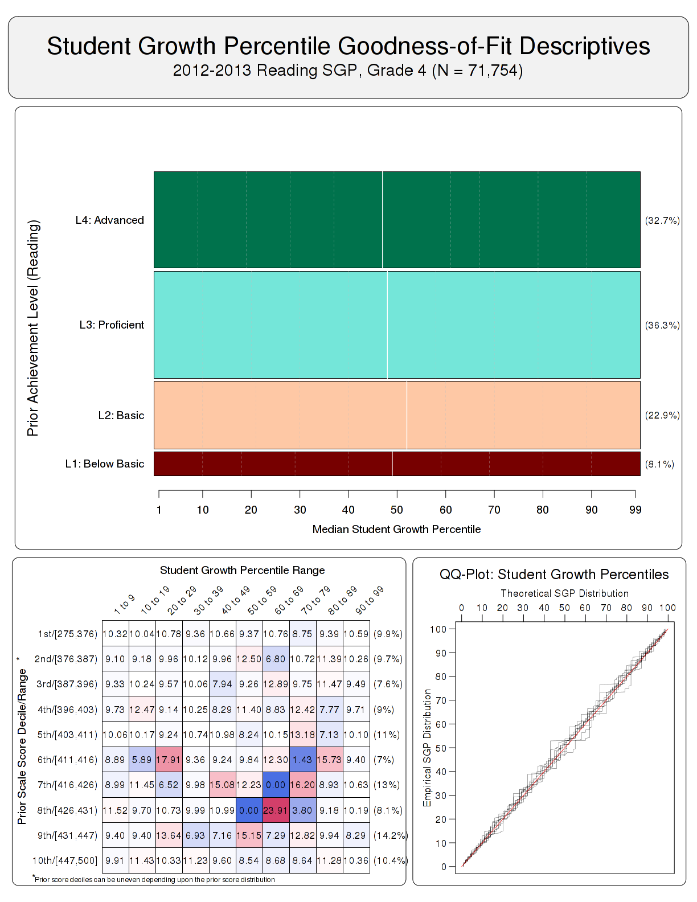
	

	
Goodness of Fit Plot for Grade 5 Reading, 2012-2013 Academic Year.

	
    
		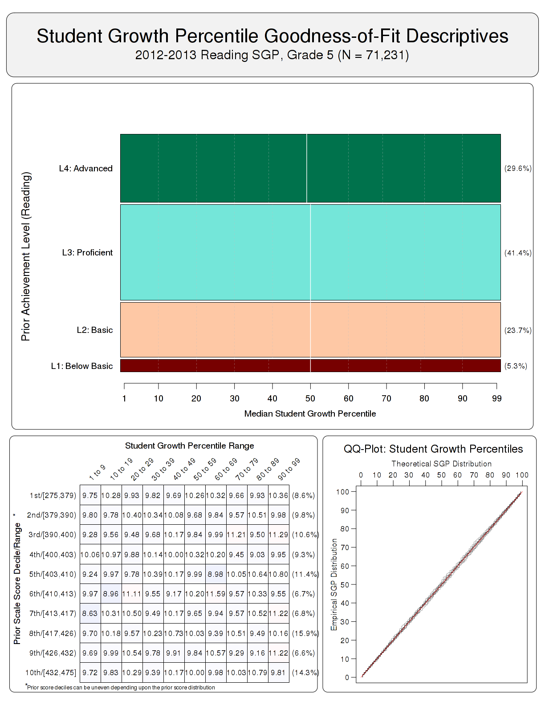
	

	
Goodness of Fit Plot for Grade 6 Reading, 2012-2013 Academic Year.

	
    
		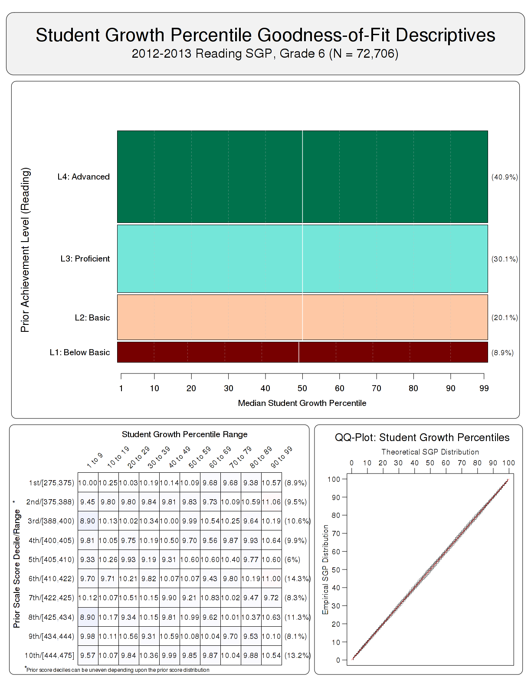
	

	
Goodness of Fit Plot for Grade 7 Reading, 2012-2013 Academic Year.

	
    
		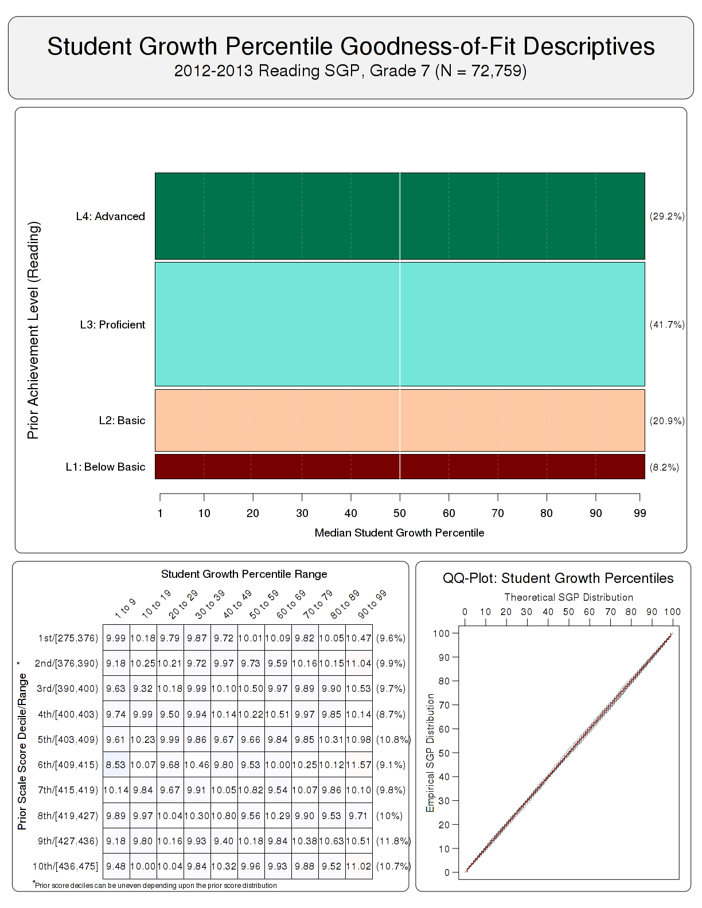
	

	
Goodness of Fit Plot for Grade 8 Reading, 2012-2013 Academic Year.

	
    
		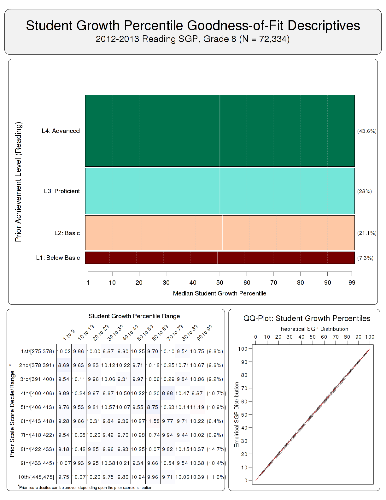
	

	
Goodness of Fit Plot for Grade 10 Reading, 2012-2013 Academic Year.

	
    
		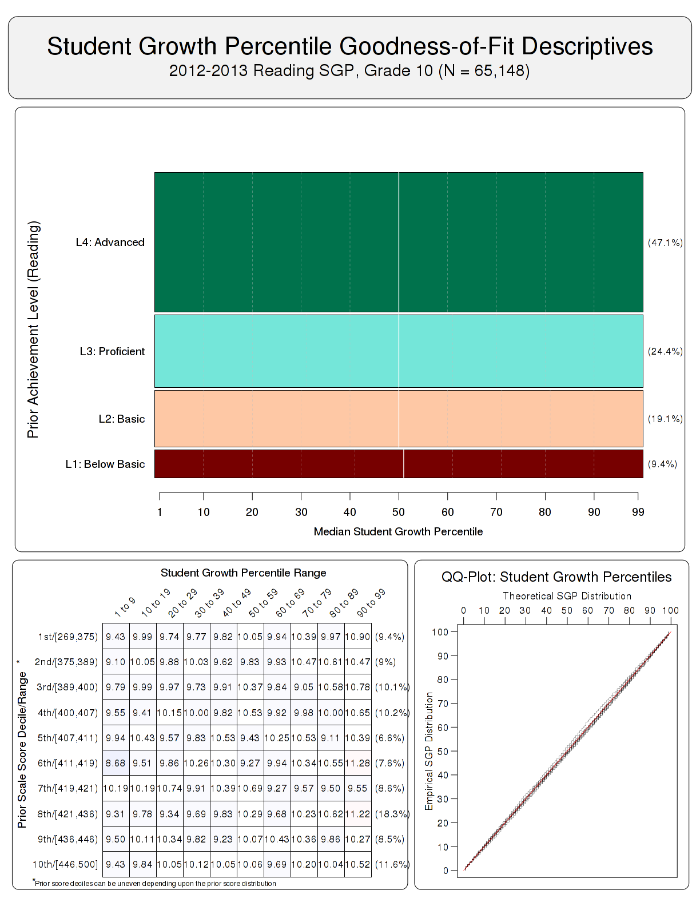
	

## Grade-Level Mathematics

	
Goodness of Fit Plot for Grade 4 Mathematics, 2012-2013 Academic Year.

	
    
		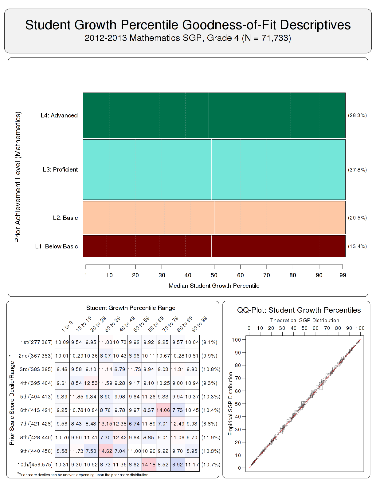
	

	
Goodness of Fit Plot for Grade 5 Mathematics, 2012-2013 Academic Year.

	
    
		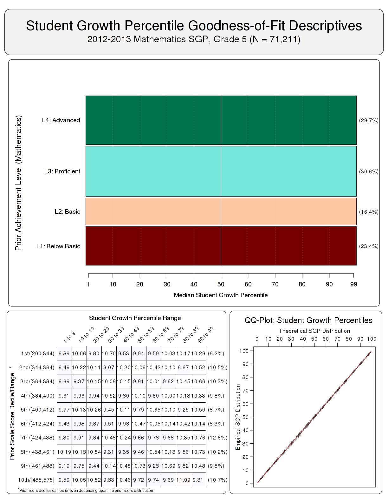
	

	
Goodness of Fit Plot for Grade 6 Mathematics, 2012-2013 Academic Year.

	
    
		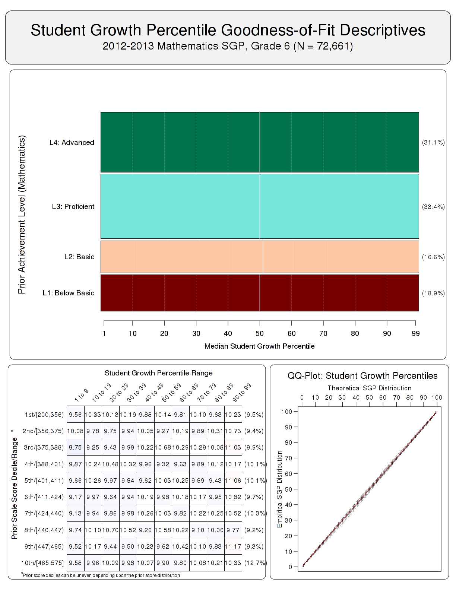
	

	
Goodness of Fit Plot for Grade 7 Mathematics, 2012-2013 Academic Year.

	
    
		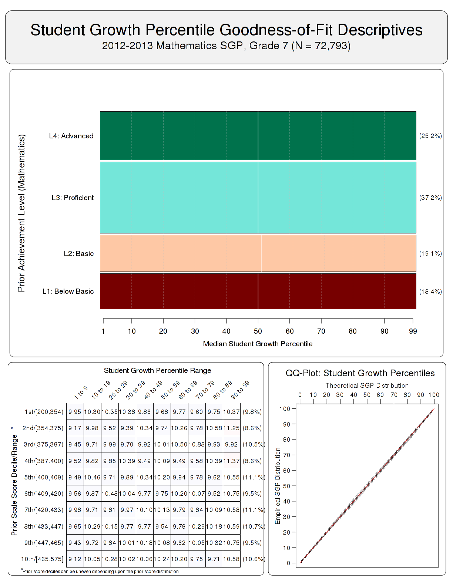
	

	
Goodness of Fit Plot for Grade 8 Mathematics, 2012-2013 Academic Year.

	
    
		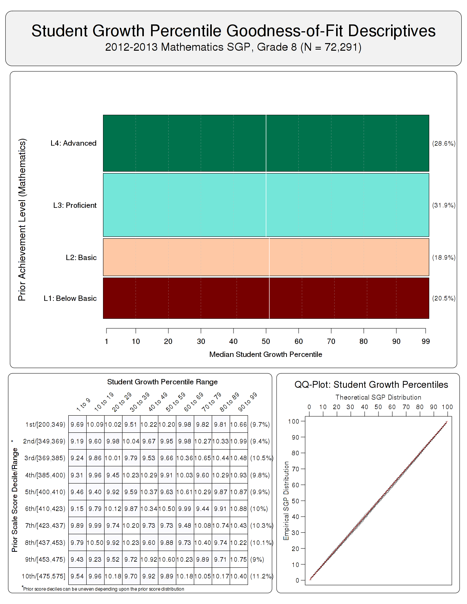
	

## EOC Mathematics 1

	
Goodness of Fit Plot for Grade 7 EOC Math 1, 2012-2013 Academic Year.

	
    
		
	

	
Goodness of Fit Plot for Grade 8 EOC Math 1, 2012-2013 Academic Year.

	
    
		
	

	
Goodness of Fit Plot for Grade 9 EOC Math 1, 2012-2013 Academic Year.

	
    
		
	

	
Goodness of Fit Plot for Grade 10 EOC Math 1, 2012-2013 Academic Year.

	
    
		
	

## EOC Mathematics 2

	
Goodness of Fit Plot for Grade 9 EOC Math 2, 2012-2013 Academic Year (7th grade Math 1st Prior).

	
    
		
	

	
Goodness of Fit Plot for Grade 9 EOC Math 2, 2012-2013 Academic Year (EOC Math 1 as 1st Prior).

	
    
		
	

	
Goodness of Fit Plot for Grade 10 EOC Math 2, 2012-2013 Academic Year (7th grade Math 1st Prior).

	
    
		
	

	
Goodness of Fit Plot for Grade 10 EOC Math 2, 2012-2013 Academic Year (EOC Math 1 as 1st Prior).

	
    
		
	

# Footnotes
1. This number does not represent the number of SGPs produced, however, because students are required to have at least one prior score available as well.
2. In addition to providing information about model fit, these student-level correlations can assess potential impact of test ceiling effects.
3. Percent Prior Proficient in this case is determined by the percent of student's that scored in the Proficient or Advanced range, of all student's that received a score.  This measure does not reflect student's that did not receive a score but are included in the denominator of Percent Meeting Standard as displayed in the OSPI Washington Report Card.
4. The scales on which students are measured are often assumed to possess properties similar to height and weight but they don't. Specifically, scales are assumed to be interval where it is assumed that a difference of 100 points at the lower end of the scale refers to the same difference in ability/achievement as 100 points at the upper end of the scale. See [Lord (1975)](#lord1975) and [Yen (1986)](#yen1986) for more detail on the interval scaling in educational measurement.
5. For the mathematical details underlying the use of quantile regression in calculating student growth percentiles, see the [Appendix *Student Growth Percentile Estimation*](#appendix-a---sgp-estimation). 
6. The establishment of the achievement target occurs in the year prior, therefore the time frame of 3 years includes the current year as "year 1", which is the year in which the first growth adequacy judgment can be made for the student.  The targets are then projected out two years beyond the current year to give a maximum time horizon of 3 years in which to make the adequacy judgement.
7. Note that because testing began in 2006 in Washington, in 2008 there is a maximum number of 2 consecutive prior achievement scores.
8. Checking growth adequacy using one-year achievement targets is equivalent to confirming whether the student reached his/her one-year achievement target since the coefficient matrices used to produce the percentile cuts are based on current data.
9. Two or more year growth targets are estimated based upon the most recent student growth histories in the state.  In this example, estimates for growth that will be needed in the 5th and 6th grades are based on students in 5th and 6th grades (concurrently) in 2013.
10. For a detailed treatment of the procedures involved in solving the optimization problem associated with Expression \ref{eqn:quantmin}, see [(Koenker, 2005)](#koenker2005), particularly Chapter 6.
11. As already noted with regard to pediatrics, the existence of nice "vertical" scales for measuring height and weight still leads to observed changes being normed.

# References

##### ballsand2004 
Ballou, D., Sanders, W., and Wright, P. (2004). Controlling for student background in value-added assessment for teachers. *Journal of Educational and Behavioral Statistics*, 29(1):37–65.

##### betebenner2008
Betebenner, D. (2008). Toward a normative understanding of student growth. In Ryan, K. E. and Shepard, L. A. (Eds.), *The Future of Test-Based Educational Accountability*, pages 155–170. Taylor & Francis, New York.

##### betebenner2009
Betebenner, D. (2009). Norm- and criterion-referenced student growth. *Educational Measurement: Issues and Practice, 28*(4):42–51.

##### sgp2013
Betebenner, D., VanIwaarden A., Domingue, B., and Shang, Y. (2013). SGP: An R Package for the Calculation and Visualization of Student Growth Percentiles & Percentile Growth Trajectories. R package version 1.2-0.0. URL http://schoolview.github.com/SGP/

##### braun2005  
Braun, H. (2005). *Using student progress to evaluate teachers: A primer on value-added models*. Technical report, Educational Testing Service, Princeton, New Jersey.

#####harrell2001
Harrell, F. (2001). *Regression Modeling Strategies*. Springer, New York.

##### harris2007
Harris, D. (2007). *The policy uses and “policy validity” of value-added and other teacher quality measures.* Technical report, Educational Testing Service, Princeton, NJ.

##### koenker2005
Koenker, R. (2005). *Quantile Regression.* Cambridge University Press, Cambridge.

##### linn2003a
Linn, R. (2003a). *Accountability: Responsibility and reasonable expectations.* Technical report, Center for the Study of Evaluation, CRESST, Los Angeles, CA.

##### linn2003b
Linn, R. (2003b). *Accountability: Responsibility and reasonable expectations.* Presidential address to the annual meeting of the American Educational Research Association, Chicago, April 23, 2003.

##### linnbake2002
Linn, R., Baker, E., and Betebenner, D. (2002). Accountability systems: Implications of requirements of the No Child Left Behind Act of 2001. *Educational Researcher, 31*(6):3–16.

##### lord1975
Lord, F. M. (1975). The “ability” scale in item characteristic curve theory. *Psychometrika*, 20:299–326.

##### mccahan2008
McCaffrey, D., Han, B., and Lockwood, J. (2008). From data to bonuses: A case study of the issues related to awarding teachers pay on the basis of their students' progress (Working Paper: 2008-14). Nashville, TN: National Center on Performance Incentives.

##### rsoftware2013
R Core Team (2013). R: A language and environment for statistical computing. R Foundation for Statistical Computing, Vienna, Austria. URL http://www.R-project.org/.

##### raud2004 
Raudenbush, S. (2004). What are value-added models estimating and what does this imply for statistical practice? *Journal of Educational and Behavioral Statistics, 29*(1):121–129.

##### rubistua2004 
Rubin, D., Stuart, E., and Zanutto, E. (2004). A potential outcomes view of value-added assessment in education. *Journal of Educational and Behavioral Statistics, 29*(1):103–116.

##### singwill2003
Singer, J. and Willett, J. (2003). *Applied Longitudinal Data Analysis*. Oxford University Press, New York.

##### spellings2005 
Spellings, M. (2005). Secretary spellings announces growth model pilot. Retrieved August 7, 2006 from http://www.ed.gov/news/pressreleases/2005/11/1182005.html.

##### weihe2006
Wei, Y. and He, X. (2006). Conditional growth charts. *The Annals of Statistics*, 34(5):2069–2097.

##### yen1986
Yen, W. (1986). The choice of scale for educational measurement: An IRT perspective. *Journal of Educational Measurement*, 23:299–325.

##### yen2007
Yen, W. (2007). Vertical scaling and No Child Left Behind. In Dorans, N. J., Pommerich, M., and Holland, P. W. (Eds.), *Linking and Aligning Scores and Scales*, pages 273–283. Springer, New York.

